# Probability Bootcamp: Hand-Written Notes

Hand-written study notes for **Probability Bootcamp** by [Dr. Steve Brunton](https://www.youtube.com/@Eigensteve) (University of Washington), the first playlist of his YouTube course on *Probability and Statistics*.

- Playlist: [Probability Bootcamp on YouTube](https://www.youtube.com/playlist?list=PLMrJAkhIeNNR3sNYvfgiKgcStwuPSts9V) (44 episodes)
- Full notes as PDF: [Probability_Bootcamp_Notes.pdf](https://drive.google.com/file/d/16eFszC2ff-S5G0cvsu3_dxtKBDFcjOnn/view?usp=sharing) (Google Drive)
- Companion notes: [Statistics and Data Analysis notes](Statistics_and_Data_Analysis_Notes.md)
- Back to the [repository README](README.md)

## About the Course

> This is the introductory overview video in a new series on Probability and Statistics! Probability and Statistics are cornerstones of modern data science and machine learning, and this short course will rapidly cover all of the basics and get into advanced topics. The course is roughly structured into four parts: Introduction to Probability (5 hours), Introduction to Statistics (5 hours), Advanced Probability (5 hours), and Advanced Statistics (5 hours).
>
> — from the description of *Probability and Statistics: Overview*

Probability Bootcamp covers a rapid short course in probability, starting from the basics (counting, set theory, conditional probability and Bayes' theorem) and building quickly to random variables and the classic distributions (binomial, normal, Poisson, geometric, exponential, gamma, chi-squared), expectation and variance, inequalities and limit theorems, and advanced topics such as moment generating functions, the Lebesgue measure and a proof of the central limit theorem.

## About These Notes

- Each image in [`hand_notes_PB/`](hand_notes_PB) is one notebook page. Most pages cover a single episode (e.g. `PB_Note_Brunton_08.png` → Episode 8); a page whose file name ends with two numbers covers two consecutive episodes (e.g. `PB_Note_Brunton_09_10.png` → Episodes 9 & 10).
- Most content follows what Dr. Brunton writes in the videos, with some supplementary notes added to clarify concepts. The **MEMO** area at the bottom of each page holds English vocabulary notes.
- ✏️ **A note on legibility:** some parts of the notes (mostly the supplementary explanations) were written in pencil, so they look lighter and are a bit harder to read in the scanned images. My apologies for the inconvenience! If a passage is hard to make out, try zooming in on the image or opening the [full PDF on Google Drive](https://drive.google.com/file/d/16eFszC2ff-S5G0cvsu3_dxtKBDFcjOnn/view?usp=sharing), which has a higher resolution.
- Episodes marked 🐍 have a companion Jupyter notebook in this repository.
- All pages are also compiled in a single [PDF on Google Drive](https://drive.google.com/file/d/16eFszC2ff-S5G0cvsu3_dxtKBDFcjOnn/view?usp=sharing).

## Episode Index

| Ep. | Title | Video | Notes | Python |
|:---:|:------|:-----:|:-----:|:------:|
| 1 | Probability and Statistics: Overview | [▶️](https://www.youtube.com/watch?v=sQqniayndb4&list=PLMrJAkhIeNNR3sNYvfgiKgcStwuPSts9V&index=1) | [📝](#ep-01) |  |
| 2 | Gentle Introduction to Probability: Counting Coin Flips and Dice | [▶️](https://www.youtube.com/watch?v=4T3aOIfNdTY&list=PLMrJAkhIeNNR3sNYvfgiKgcStwuPSts9V&index=2) | [📝](#ep-02) |  |
| 3 | Counting Probabilities with Combinatorics and the Factorial | [▶️](https://www.youtube.com/watch?v=5mDYZMwTAF8&list=PLMrJAkhIeNNR3sNYvfgiKgcStwuPSts9V&index=3) | [📝](#ep-03) |  |
| 4 | Set Theory in Probability: Sample Spaces and Events | [▶️](https://www.youtube.com/watch?v=b_ev4Hdzh-U&list=PLMrJAkhIeNNR3sNYvfgiKgcStwuPSts9V&index=4) | [📝](#ep-04) |  |
| 5 | The Birthday Problem in Probability: P(A) = 1 - P(not A) | [▶️](https://www.youtube.com/watch?v=m7hI2LulMxE&list=PLMrJAkhIeNNR3sNYvfgiKgcStwuPSts9V&index=5) | [📝](#ep-05) | [🐍](PB05_The%20Birthday%20Problem%20in%20Probability.ipynb) |
| 6 | Quality Control, Non-Destructive Inspection, and the Multinomial Distribution | [▶️](https://www.youtube.com/watch?v=e7RAK_iQBp0&list=PLMrJAkhIeNNR3sNYvfgiKgcStwuPSts9V&index=6) | [📝](#ep-06) | [🐍](PB06_Quality%20Control%2C%20Non-destructive%20Inspection%2C%20and%20the%20Hypergeometric%20Distribution.ipynb) |
| 7 | The Binomial Distribution and the Multinomial Distribution | [▶️](https://www.youtube.com/watch?v=UXB9eeMZfwo&list=PLMrJAkhIeNNR3sNYvfgiKgcStwuPSts9V&index=7) | [📝](#ep-07) | [🐍](PB07_The%20Binomial%20Distribution%20and%20the%20Multinomial%20Distribution.ipynb) |
| 8 | Conditional Probabilities | [▶️](https://www.youtube.com/watch?v=KjdS_o5HNII&list=PLMrJAkhIeNNR3sNYvfgiKgcStwuPSts9V&index=8) | [📝](#ep-08) |  |
| 9 | The Law of Total Probability | [▶️](https://www.youtube.com/watch?v=UzEPJEQF4W0&list=PLMrJAkhIeNNR3sNYvfgiKgcStwuPSts9V&index=9) | [📝](#ep-09-10) |  |
| 10 | Bayes' Theorem (with Example!) | [▶️](https://www.youtube.com/watch?v=akClB1J6b28&list=PLMrJAkhIeNNR3sNYvfgiKgcStwuPSts9V&index=10) | [📝](#ep-09-10) |  |
| 11 | Bayes' Theorem Example: Drug Testing | [▶️](https://www.youtube.com/watch?v=gE6RnZJixUw&list=PLMrJAkhIeNNR3sNYvfgiKgcStwuPSts9V&index=11) | [📝](#ep-11) |  |
| 12 | Independence in Probability | [▶️](https://www.youtube.com/watch?v=2nDYX8IKrwo&list=PLMrJAkhIeNNR3sNYvfgiKgcStwuPSts9V&index=12) | [📝](#ep-12) |  |
| 13 | Random Variables and Probability Distributions | [▶️](https://www.youtube.com/watch?v=-7QG2itL1u4&list=PLMrJAkhIeNNR3sNYvfgiKgcStwuPSts9V&index=13) | [📝](#ep-13) |  |
| 14 | Bernoulli and Binomial Random Variables | [▶️](https://www.youtube.com/watch?v=Tc6g-Y-l0Rg&list=PLMrJAkhIeNNR3sNYvfgiKgcStwuPSts9V&index=14) | [📝](#ep-14) |  |
| 15 | The Normal Distribution: The Limit of Binomial Distribution for Large "n" | [▶️](https://www.youtube.com/watch?v=8n1n0OM4gLk&list=PLMrJAkhIeNNR3sNYvfgiKgcStwuPSts9V&index=15) | [📝](#ep-15) | [🐍](PB15_The%20Normal%20Distribution-%20The%20Limit%20of%20Binomial%20Distribution%20for%20Large%20n.ipynb) |
| 16 | The Standard Unit Normal and Probability Computations | [▶️](https://www.youtube.com/watch?v=X9Pkzaw0SpE&list=PLMrJAkhIeNNR3sNYvfgiKgcStwuPSts9V&index=16) | [📝](#ep-16) | [🐍](PB16_The%20Standard%20Unit%20Normal%20and%20Probability%20Computation.ipynb) |
| 17 | The Poisson Distribution: The Rare Event Limit of a Binomial Distribution | [▶️](https://www.youtube.com/watch?v=7vXLH2H6fZw&list=PLMrJAkhIeNNR3sNYvfgiKgcStwuPSts9V&index=17) | [📝](#ep-17) | [🐍](PB17_The%20Poisson%20Distribution-%20the%20Rare%20Event%20Limit%20of%20a%20Binomial%20Distribution.ipynb) |
| 18 | The Geometric Distribution: The First Success of a Bernoulli Distribution | [▶️](https://www.youtube.com/watch?v=0lpOeU6JZZw&list=PLMrJAkhIeNNR3sNYvfgiKgcStwuPSts9V&index=18) | [📝](#ep-18) |  |
| 19 | The Exponential Distribution: Time Between Poisson Events | [▶️](https://www.youtube.com/watch?v=C7V3d2yB58U&list=PLMrJAkhIeNNR3sNYvfgiKgcStwuPSts9V&index=19) | [📝](#ep-19) |  |
| 20 | The Hazard Rate and Memoryless Property of the Exponential Distribution | [▶️](https://www.youtube.com/watch?v=8qZilAKQM6s&list=PLMrJAkhIeNNR3sNYvfgiKgcStwuPSts9V&index=20) | [📝](#ep-20) |  |
| 21 | The Connection Between the Exponential Distribution and the Poisson Process | [▶️](https://www.youtube.com/watch?v=OWYGlwy0lkI&list=PLMrJAkhIeNNR3sNYvfgiKgcStwuPSts9V&index=21) | [📝](#ep-21) |  |
| 22 | The Gamma Distribution | [▶️](https://www.youtube.com/watch?v=9IIcHAJlcWc&list=PLMrJAkhIeNNR3sNYvfgiKgcStwuPSts9V&index=22) | [📝](#ep-22) |  |
| 23 | Functions of a Random Variable | [▶️](https://www.youtube.com/watch?v=hC2idx2-GME&list=PLMrJAkhIeNNR3sNYvfgiKgcStwuPSts9V&index=23) | [📝](#ep-23-24) |  |
| 24 | Rescaling the Normal Distribution to Mean Zero and Variance One | [▶️](https://www.youtube.com/watch?v=pm4si2u-ZC4&list=PLMrJAkhIeNNR3sNYvfgiKgcStwuPSts9V&index=24) | [📝](#ep-23-24) |  |
| 25 | The Chi Squared Distribution: The Square of the Normal Distribution | [▶️](https://www.youtube.com/watch?v=h9j849vAsAA&list=PLMrJAkhIeNNR3sNYvfgiKgcStwuPSts9V&index=25) | [📝](#ep-25) |  |
| 26 | Joint Probability Distributions | [▶️](https://www.youtube.com/watch?v=NBo5bXIX7Ac&list=PLMrJAkhIeNNR3sNYvfgiKgcStwuPSts9V&index=26) | [📝](#ep-26) |  |
| 27 | Joint Probability Distributions: Marginal and Conditional Densities | [▶️](https://www.youtube.com/watch?v=pribJ8bUBzo&list=PLMrJAkhIeNNR3sNYvfgiKgcStwuPSts9V&index=27) | [📝](#ep-27) |  |
| 28 | The Expected Value (Mean) of a Probability Distribution | [▶️](https://www.youtube.com/watch?v=CBgCR1kHSUI&list=PLMrJAkhIeNNR3sNYvfgiKgcStwuPSts9V&index=28) | [📝](#ep-28) |  |
| 29 | Properties of the Expected Value | [▶️](https://www.youtube.com/watch?v=8rnzHE2UtoM&list=PLMrJAkhIeNNR3sNYvfgiKgcStwuPSts9V&index=29) | [📝](#ep-29-30) |  |
| 30 | Variance and Standard Deviation | [▶️](https://www.youtube.com/watch?v=dmSRMYQsM8w&list=PLMrJAkhIeNNR3sNYvfgiKgcStwuPSts9V&index=30) | [📝](#ep-29-30) |  |
| 31 | Example of Computing the Expectation and Variance of an Exponential Distribution | [▶️](https://www.youtube.com/watch?v=Fz9_yqdEt-I&list=PLMrJAkhIeNNR3sNYvfgiKgcStwuPSts9V&index=31) | [📝](#ep-31) |  |
| 32 | Two Examples of Expected Values & Functions: Temperature in C vs F, and the Kinetic Theory of Gases | [▶️](https://www.youtube.com/watch?v=fB6-lCdkEdQ&list=PLMrJAkhIeNNR3sNYvfgiKgcStwuPSts9V&index=32) | [📝](#ep-32) |  |
| 33 | Markov's Inequality in Probability: First Order Estimates | [▶️](https://www.youtube.com/watch?v=onZSWfbTeho&list=PLMrJAkhIeNNR3sNYvfgiKgcStwuPSts9V&index=33) | [📝](#ep-33-34) |  |
| 34 | Chebyshev's Inequality in Probability: Second Order Estimates | [▶️](https://www.youtube.com/watch?v=otCHN3s52ho&list=PLMrJAkhIeNNR3sNYvfgiKgcStwuPSts9V&index=34) | [📝](#ep-33-34) |  |
| 35 | The Law of Large Numbers | [▶️](https://www.youtube.com/watch?v=0VoRWJMt6mk&list=PLMrJAkhIeNNR3sNYvfgiKgcStwuPSts9V&index=35) | [📝](#ep-35-36) |  |
| 36 | The Central Limit Theorem | [▶️](https://www.youtube.com/watch?v=ckkrS752tjU&list=PLMrJAkhIeNNR3sNYvfgiKgcStwuPSts9V&index=36) | [📝](#ep-35-36) |  |
| 37 | The Moment Generating Function | [▶️](https://www.youtube.com/watch?v=u0ku4bvp40I&list=PLMrJAkhIeNNR3sNYvfgiKgcStwuPSts9V&index=37) | [📝](#ep-37) |  |
| 38 | Example of The Moment Generating Function | [▶️](https://www.youtube.com/watch?v=JjaOtHaDy9E&list=PLMrJAkhIeNNR3sNYvfgiKgcStwuPSts9V&index=38) | [📝](#ep-38) |  |
| 39 | The Lebesgue Measure in Probability | [▶️](https://www.youtube.com/watch?v=j6AD6Dm9sSs&list=PLMrJAkhIeNNR3sNYvfgiKgcStwuPSts9V&index=39) | [📝](#ep-39-40) |  |
| 40 | Additive Property of the Moment Generating Function | [▶️](https://www.youtube.com/watch?v=rn655n2JtgI&list=PLMrJAkhIeNNR3sNYvfgiKgcStwuPSts9V&index=40) | [📝](#ep-39-40) |  |
| 41 | Covariance and Correlation in Probability | [▶️](https://www.youtube.com/watch?v=QKPdk57y7Ck&list=PLMrJAkhIeNNR3sNYvfgiKgcStwuPSts9V&index=41) | [📝](#ep-41-42) |  |
| 42 | Covariance and Correlation: Example with Gaussian Distributions | [▶️](https://www.youtube.com/watch?v=upPn685IU_Q&list=PLMrJAkhIeNNR3sNYvfgiKgcStwuPSts9V&index=42) | [📝](#ep-41-42) |  |
| 43 | The Tail Sum Formula in Probability | [▶️](https://www.youtube.com/watch?v=XQYkD_fct1A&list=PLMrJAkhIeNNR3sNYvfgiKgcStwuPSts9V&index=43) | [📝](#ep-43) |  |
| 44 | Proof of the Central Limit Theorem | [▶️](https://www.youtube.com/watch?v=nWadI0_u6QU&list=PLMrJAkhIeNNR3sNYvfgiKgcStwuPSts9V&index=44) | [📝](#ep-44) |  |

## Notes by Episode

### Episode 1: Probability and Statistics: Overview

▶️ [Watch on YouTube](https://www.youtube.com/watch?v=sQqniayndb4&list=PLMrJAkhIeNNR3sNYvfgiKgcStwuPSts9V&index=1)

> This is the introductory overview video in a new series on Probability and Statistics! Probability and Statistics are cornerstones of modern data science and machine learning, and this short course will rapidly cover all of the basics and get into advanced topics. The course is roughly structured into four parts: Introduction to Probability (5 hours), Introduction to Statistics (5 hours), Advanced Probability (5 hours), and Advanced Statistics (5 hours).

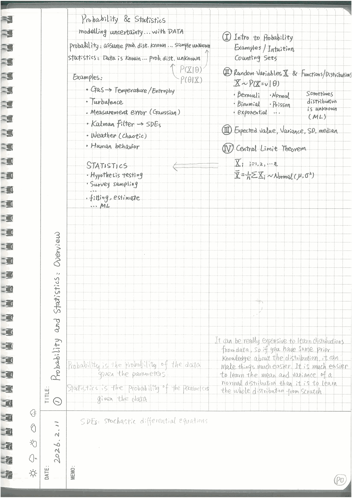

[⬆ Back to index](#episode-index)

---

### Episode 2: Gentle Introduction to Probability: Counting Coin Flips and Dice

▶️ [Watch on YouTube](https://www.youtube.com/watch?v=4T3aOIfNdTY&list=PLMrJAkhIeNNR3sNYvfgiKgcStwuPSts9V&index=2)

> This video provides a simple introduction to probability, starting with the basic idea of counting random events. We will use random coin flips and dice rolls to illustrate these concepts. Interestingly, neither coin flips or dice rolls are actually random, but there is enough uncertainty in their motion that to us humans, they appear random.

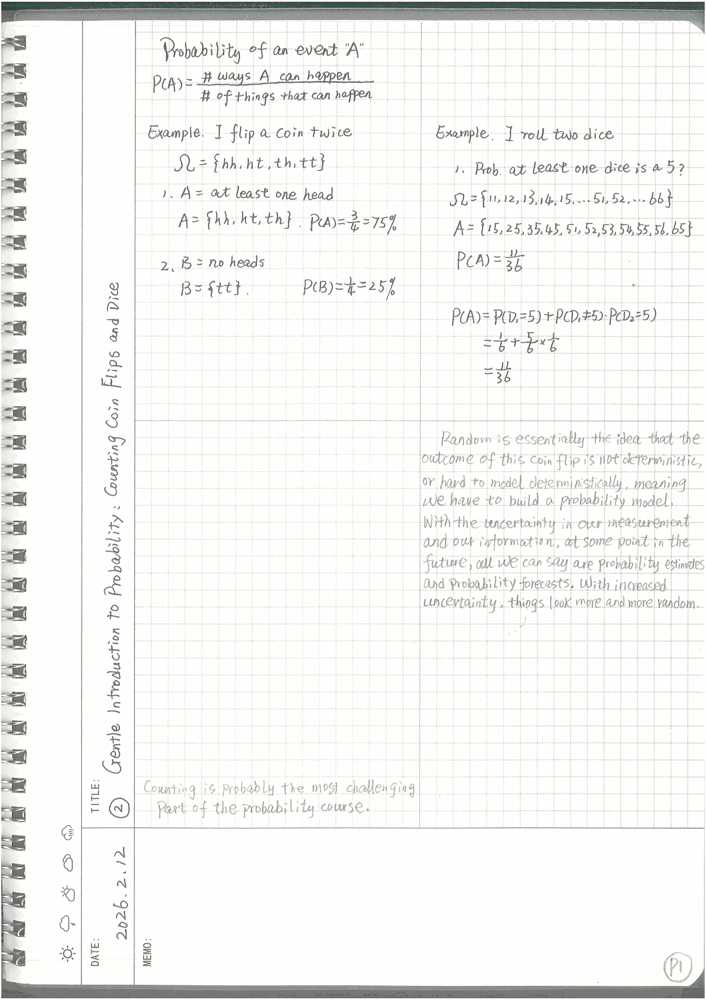

[⬆ Back to index](#episode-index)

---

### Episode 3: Counting Probabilities with Combinatorics and the Factorial

▶️ [Watch on YouTube](https://www.youtube.com/watch?v=5mDYZMwTAF8&list=PLMrJAkhIeNNR3sNYvfgiKgcStwuPSts9V&index=3)

> Here we describe some of the most useful concepts in probability: combinatorics and the factorial. We will be able to count how many ways a certain event can happen, such as how many ways I can get 5 heads in 10 coin flips, and how many 5 card hands can I deal off of a 52 car deck. We will discuss sampling with and without replacement, and the various formulas to compute these probabilities.

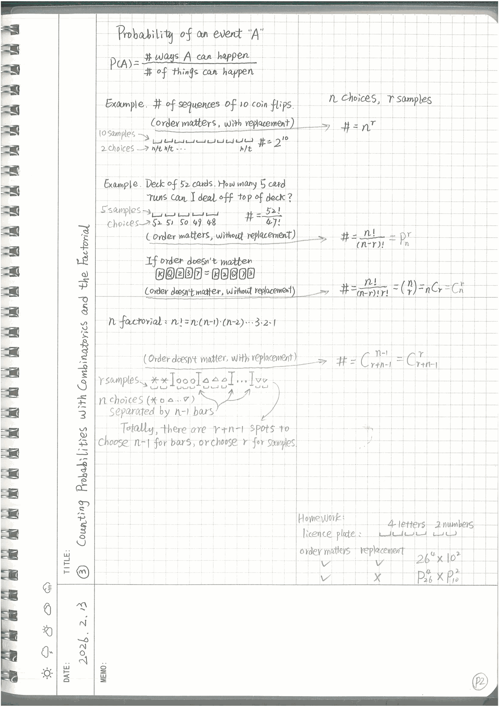

[⬆ Back to index](#episode-index)

---

### Episode 4: Set Theory in Probability: Sample Spaces and Events

▶️ [Watch on YouTube](https://www.youtube.com/watch?v=b_ev4Hdzh-U&list=PLMrJAkhIeNNR3sNYvfgiKgcStwuPSts9V&index=4)

> Here we briefly introduce the fundamental concepts of set theory which is used to formalize the notion of sample and event spaces in probability. We discuss the union, intersection, and complement of a set, with examples.

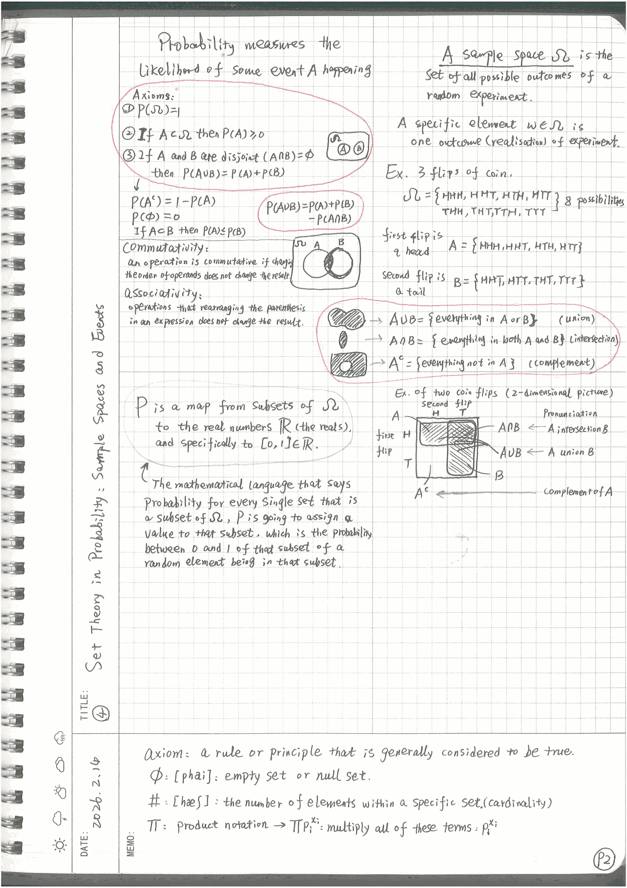

[⬆ Back to index](#episode-index)

---

### Episode 5: The Birthday Problem in Probability: P(A) = 1 - P(not A)

▶️ [Watch on YouTube](https://www.youtube.com/watch?v=m7hI2LulMxE&list=PLMrJAkhIeNNR3sNYvfgiKgcStwuPSts9V&index=5) · 🐍 [Python notebook](PB05_The%20Birthday%20Problem%20in%20Probability.ipynb)

> The birthday problem is fun and surprisingly challenging: How many people need to be in a room before the probability that two people share the same birthday is at least 50%? To solve this problem, we find that it is much easier to compute 1 minus the probability that two people *don't* share a birthday. This idea will be very useful in other problems.

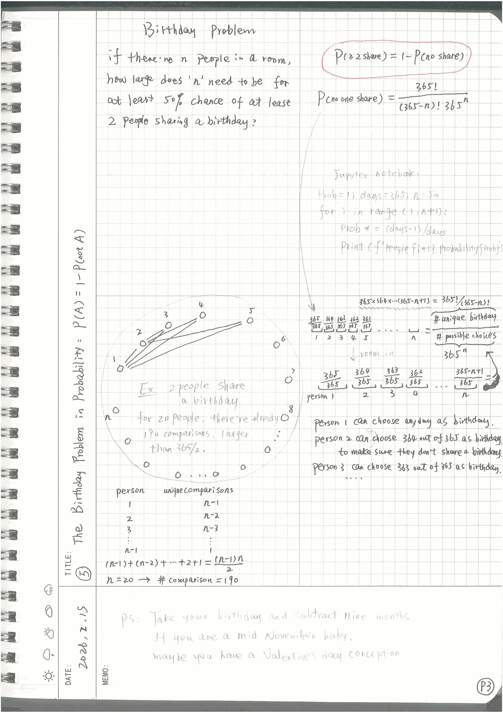

[⬆ Back to index](#episode-index)

---

### Episode 6: Quality Control, Non-Destructive Inspection, and the Multinomial Distribution

▶️ [Watch on YouTube](https://www.youtube.com/watch?v=e7RAK_iQBp0&list=PLMrJAkhIeNNR3sNYvfgiKgcStwuPSts9V&index=6) · 🐍 [Python notebook](PB06_Quality%20Control%2C%20Non-destructive%20Inspection%2C%20and%20the%20Hypergeometric%20Distribution.ipynb)

> Here we introduce a relevant example of the multinomial distribution: quality control and non-destructive inspection. If we test a sub-sample of size "r" and measure "m" defective items, what can we say about the reliability of the overall batch?

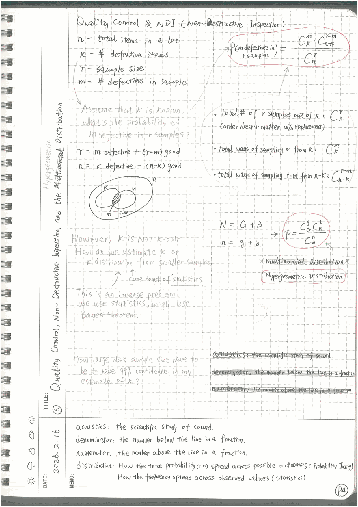

[⬆ Back to index](#episode-index)

---

### Episode 7: The Binomial Distribution and the Multinomial Distribution

▶️ [Watch on YouTube](https://www.youtube.com/watch?v=UXB9eeMZfwo&list=PLMrJAkhIeNNR3sNYvfgiKgcStwuPSts9V&index=7) · 🐍 [Python notebook](PB07_The%20Binomial%20Distribution%20and%20the%20Multinomial%20Distribution.ipynb)

> Here we introduce the binomial distribution, which is one of the most important distributions in all of probability. It will be the basis of the Normal distribution and the Poisson distribution. The binomial distribution quantifies the probability of getting "r" successes in "n" Bernoulli trials. For example, the probability of getting 5 heads in 10 coin flips is Binomially distributed. We also introduce the more general multinomial distribution.

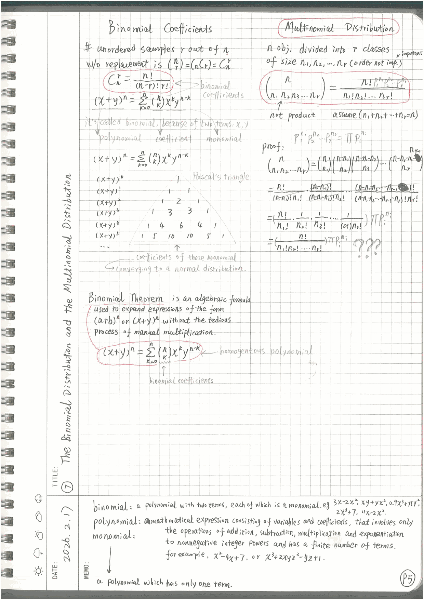

[⬆ Back to index](#episode-index)

---

### Episode 8: Conditional Probabilities

▶️ [Watch on YouTube](https://www.youtube.com/watch?v=KjdS_o5HNII&list=PLMrJAkhIeNNR3sNYvfgiKgcStwuPSts9V&index=8)

> Conditional probability is a central idea, where we compute the probability of an event "A" occurring given that we also have information about an event "B" occurring. For example, if I roll a fair dice, event "A" might be that I roll a 6 and event "B" might be that I roll higher than a 3. If someone tells me that "B" definitely occurred, then it changes the probability of "A", now that I know that "B" is true. This will be a fundamental concept when we develop Bayesian statistics.

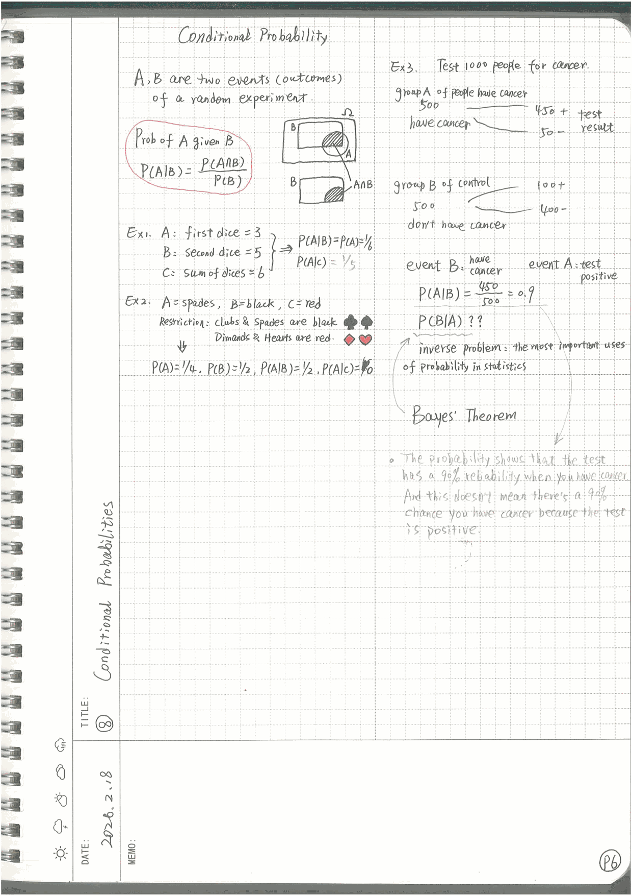

[⬆ Back to index](#episode-index)

---

### Episodes 9 & 10: The Law of Total Probability / Bayes' Theorem (with Example!)

**Episode 9: The Law of Total Probability**

▶️ [Watch on YouTube](https://www.youtube.com/watch?v=UzEPJEQF4W0&list=PLMrJAkhIeNNR3sNYvfgiKgcStwuPSts9V&index=9)

> The law of total probability essentially states that the probabilities of all possible disjoint events must sum to one. Said another way, "something must happen".

**Episode 10: Bayes' Theorem (with Example!)**

▶️ [Watch on YouTube](https://www.youtube.com/watch?v=akClB1J6b28&list=PLMrJAkhIeNNR3sNYvfgiKgcStwuPSts9V&index=10)

> Bayes' Theorem is one of the most central ideas in all of probability and statistics, and is one of the primary perspectives in modern machine learning too. This video gently introduces the simple concept of Bayes' theorem, including defining the posterior, prior, and update.

[⬆ Back to index](#episode-index)

---

### Episode 11: Bayes' Theorem Example: Drug Testing

▶️ [Watch on YouTube](https://www.youtube.com/watch?v=gE6RnZJixUw&list=PLMrJAkhIeNNR3sNYvfgiKgcStwuPSts9V&index=11)

> This video provides a simple example of how to use Bayes' theorem for drug screening.

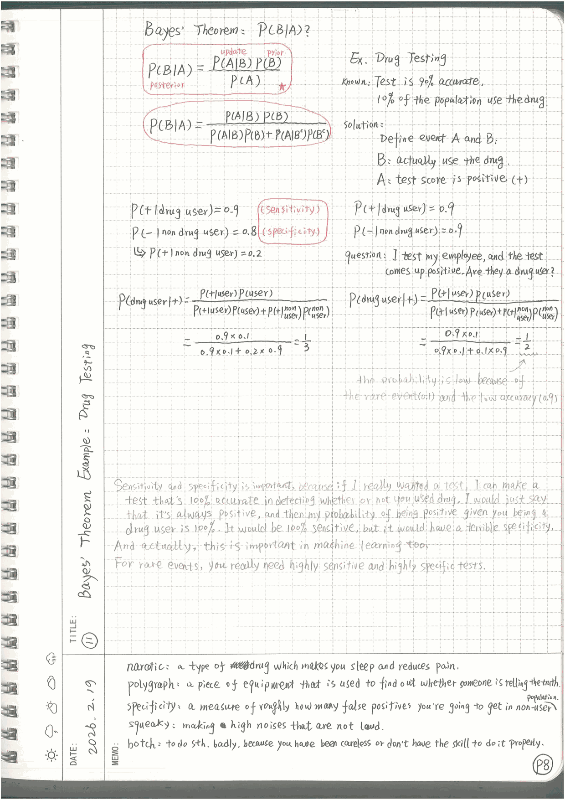

[⬆ Back to index](#episode-index)

---

### Episode 12: Independence in Probability

▶️ [Watch on YouTube](https://www.youtube.com/watch?v=2nDYX8IKrwo&list=PLMrJAkhIeNNR3sNYvfgiKgcStwuPSts9V&index=12)

> Independence is another important concept in probability that tells if two events "A" and "B" depend on each other. Examples of independent events would be "A" drawing a Queen from a deck of cards, and "B" drawing a spade. These don't affect each other at all, and knowing one doesn't change the probability of the other.

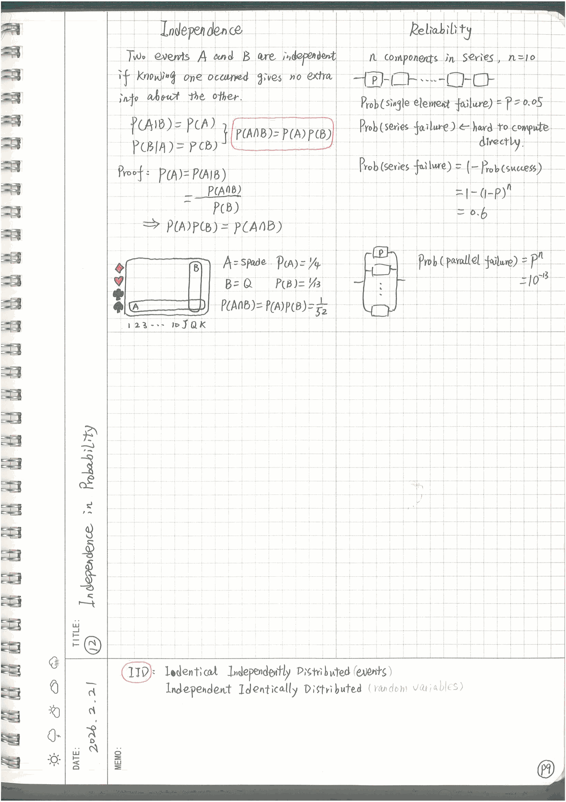

[⬆ Back to index](#episode-index)

---

### Episode 13: Random Variables and Probability Distributions

▶️ [Watch on YouTube](https://www.youtube.com/watch?v=-7QG2itL1u4&list=PLMrJAkhIeNNR3sNYvfgiKgcStwuPSts9V&index=13)

> This video introduces the notion of a random variable "X". Random variables are similar to standard variables in calculus, except they have a probability that follows a distribution, like a Gaussian. Random variables are a key abstraction that will allow us to bring powerful tools from calculus and analysis to probability and statistics.

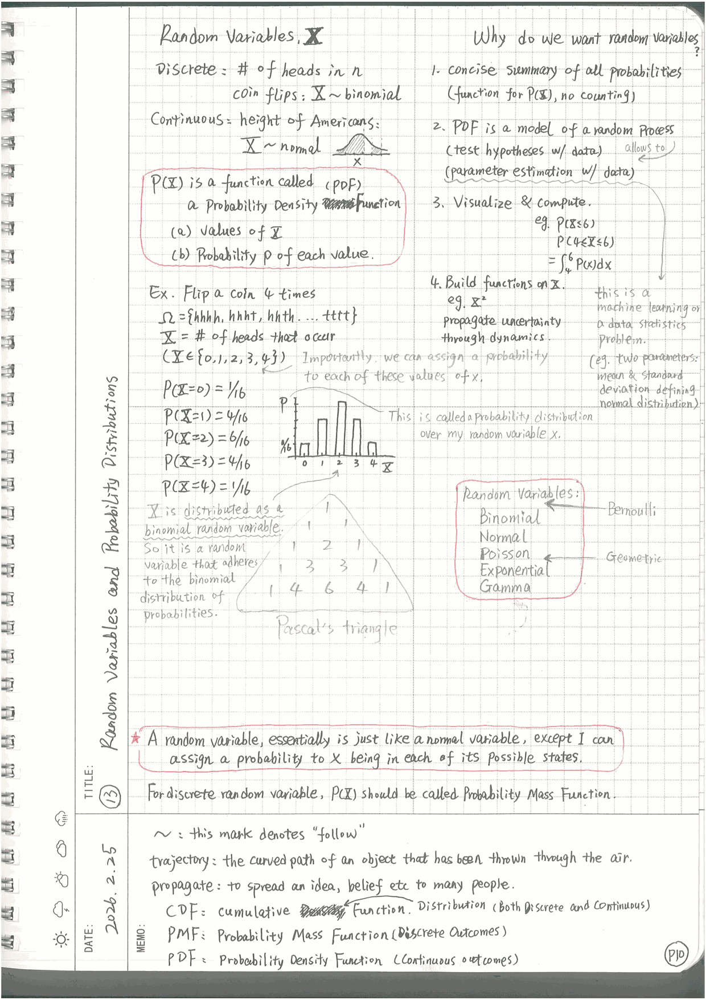

[⬆ Back to index](#episode-index)

---

### Episode 14: Bernoulli and Binomial Random Variables

▶️ [Watch on YouTube](https://www.youtube.com/watch?v=Tc6g-Y-l0Rg&list=PLMrJAkhIeNNR3sNYvfgiKgcStwuPSts9V&index=14)

> Bernoulli and Binomial random variables are key building blocks for more sophisticated distributions, such as the Normal and Poisson distributions. A Bernoulli random variable takes one of two values, like a coin flip. A Binomial random variable is constructed by repeating several Bernoulli random trials; for example, if we flip 10 coins, the number of heads is a Binomial random variable.

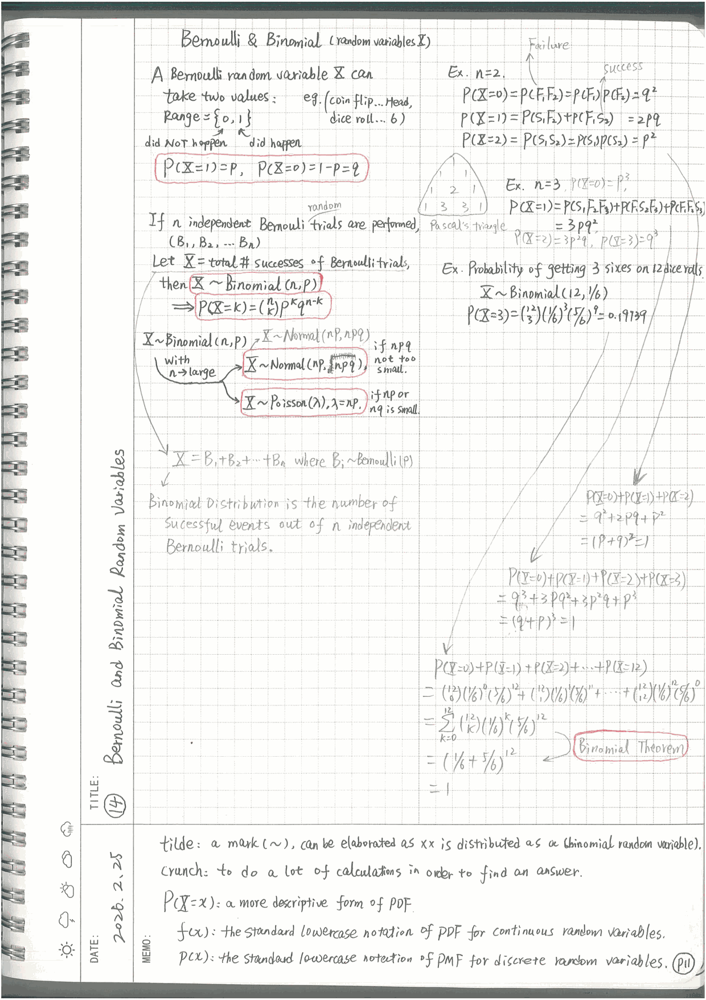

[⬆ Back to index](#episode-index)

---

### Episode 15: The Normal Distribution: The Limit of Binomial Distribution for Large "n"

▶️ [Watch on YouTube](https://www.youtube.com/watch?v=8n1n0OM4gLk&list=PLMrJAkhIeNNR3sNYvfgiKgcStwuPSts9V&index=15) · 🐍 [Python notebook](PB15_The%20Normal%20Distribution-%20The%20Limit%20of%20Binomial%20Distribution%20for%20Large%20n.ipynb)

> The Normal distribution, or "Gaussian", is one of the most important probability distributions. It is the limit of a Binomial distribution for large "n" (for a large number of underlying Bernoulli trials). The normal distribution is quite common across statistics, for example to approximate the height of adults in a country.

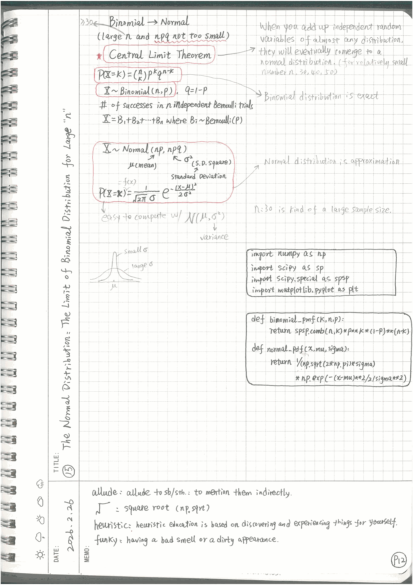

[⬆ Back to index](#episode-index)

---

### Episode 16: The Standard Unit Normal and Probability Computations

▶️ [Watch on YouTube](https://www.youtube.com/watch?v=X9Pkzaw0SpE&list=PLMrJAkhIeNNR3sNYvfgiKgcStwuPSts9V&index=16) · 🐍 [Python notebook](PB16_The%20Standard%20Unit%20Normal%20and%20Probability%20Computation.ipynb)

> It is often helpful to work with a "standard unit normal" distribution, which is a Gaussian with zero mean and unit standard deviation. It is possible to transform other normal distributions into this standard form, through a simple mean-centering and scaling procedure, after which it is easy to compute probabilities. For example, if I want to know what percentile my height is in the USA, I could first transform the normal distribution of heights to standard unit normal, and then see where my transformed height lies. This will allow me to easily compute various quantities.

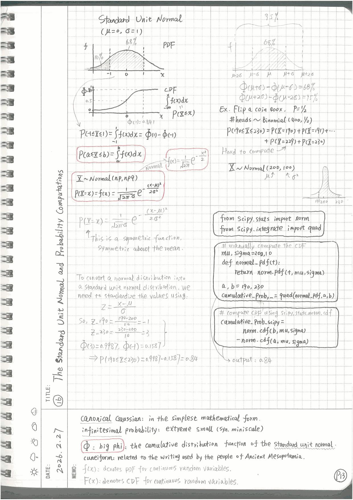

[⬆ Back to index](#episode-index)

---

### Episode 17: The Poisson Distribution: The Rare Event Limit of a Binomial Distribution

▶️ [Watch on YouTube](https://www.youtube.com/watch?v=7vXLH2H6fZw&list=PLMrJAkhIeNNR3sNYvfgiKgcStwuPSts9V&index=17) · 🐍 [Python notebook](PB17_The%20Poisson%20Distribution-%20the%20Rare%20Event%20Limit%20of%20a%20Binomial%20Distribution.ipynb)

> The Poisson distribution is one of the most important probability distributions, quantifying the probability of rare events occuring. It is another limit of the binomial distribution, but for low-probability events.

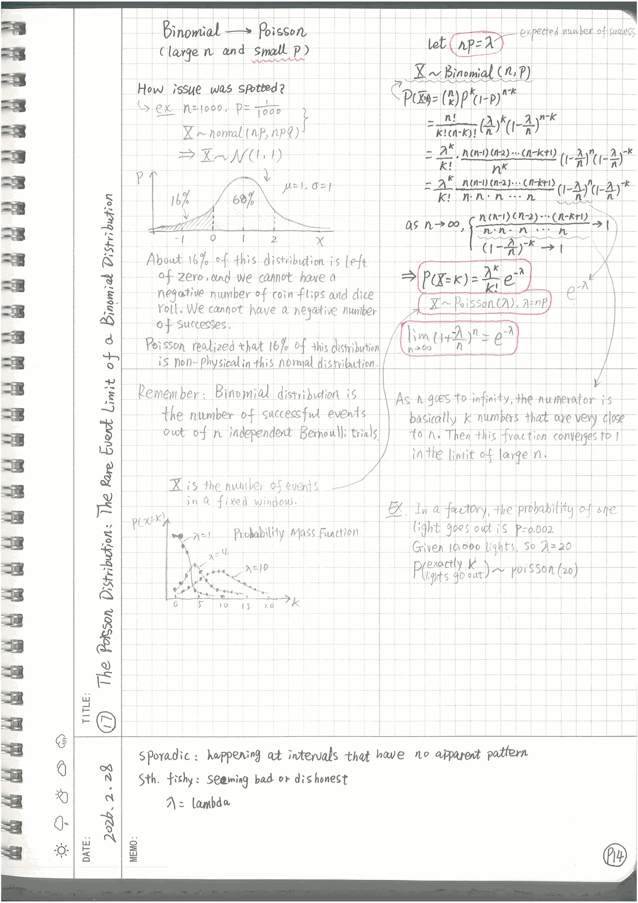

[⬆ Back to index](#episode-index)

---

### Episode 18: The Geometric Distribution: The First Success of a Bernoulli Distribution

▶️ [Watch on YouTube](https://www.youtube.com/watch?v=0lpOeU6JZZw&list=PLMrJAkhIeNNR3sNYvfgiKgcStwuPSts9V&index=18)

> The geometric distribution is a very intuitive probability density that is also derived from independent Bernoulli. The geometric distribution quantifies the probability that the first success of a Bernoulli process will occur on the n-th trial.

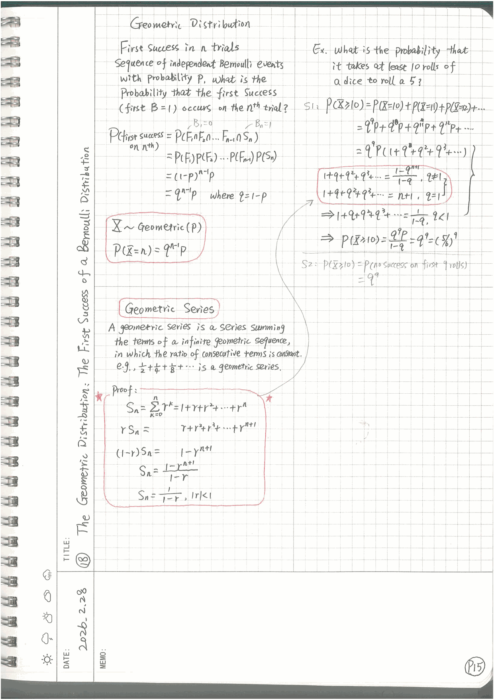

[⬆ Back to index](#episode-index)

---

### Episode 19: The Exponential Distribution: Time Between Poisson Events

▶️ [Watch on YouTube](https://www.youtube.com/watch?v=C7V3d2yB58U&list=PLMrJAkhIeNNR3sNYvfgiKgcStwuPSts9V&index=19)

> The exponential distribution is the probability distribution that quantifies the probability of a given time between Poisson (rare) events.

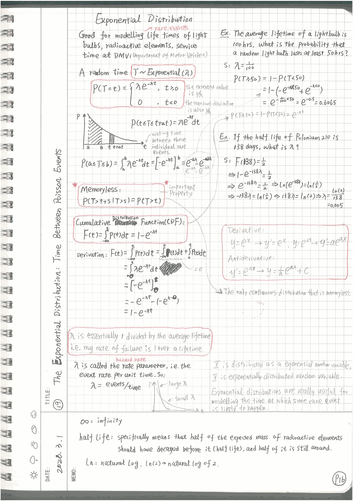

[⬆ Back to index](#episode-index)

---

### Episode 20: The Hazard Rate and Memoryless Property of the Exponential Distribution

▶️ [Watch on YouTube](https://www.youtube.com/watch?v=8qZilAKQM6s&list=PLMrJAkhIeNNR3sNYvfgiKgcStwuPSts9V&index=20)

> The hazard rate is the instantaneous rate of occurance of a Poisson process, and it is closely related to the exponential distribution.

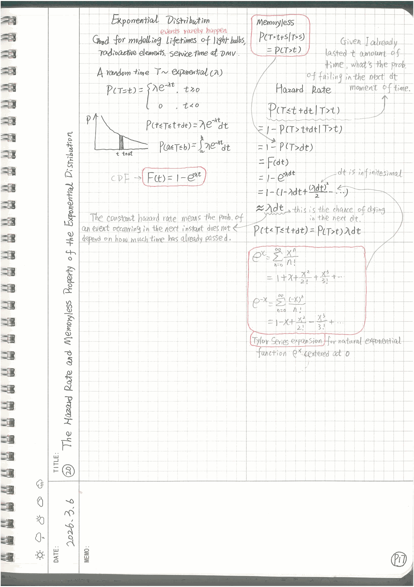

[⬆ Back to index](#episode-index)

---

### Episode 21: The Connection Between the Exponential Distribution and the Poisson Process

▶️ [Watch on YouTube](https://www.youtube.com/watch?v=OWYGlwy0lkI&list=PLMrJAkhIeNNR3sNYvfgiKgcStwuPSts9V&index=21)

> The exponential distribution quantifies the probability of the time to the next even in a Poisson process. For example, the time to the next email (although getting an email is no longer a rare event!)

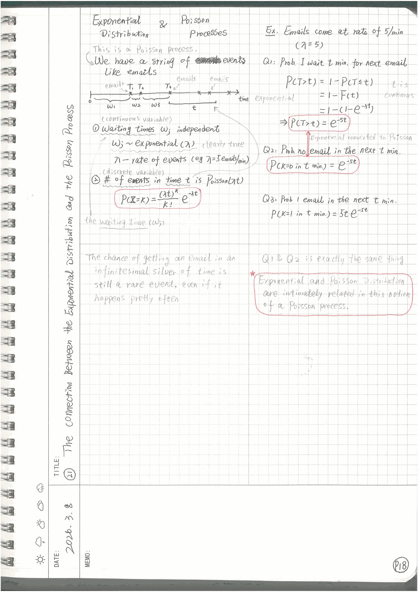

[⬆ Back to index](#episode-index)

---

### Episode 22: The Gamma Distribution

▶️ [Watch on YouTube](https://www.youtube.com/watch?v=9IIcHAJlcWc&list=PLMrJAkhIeNNR3sNYvfgiKgcStwuPSts9V&index=22)

> The gamma distribution is closely related to the exponential distribution, as it is the waiting time for the r-th event in a Poisson process.

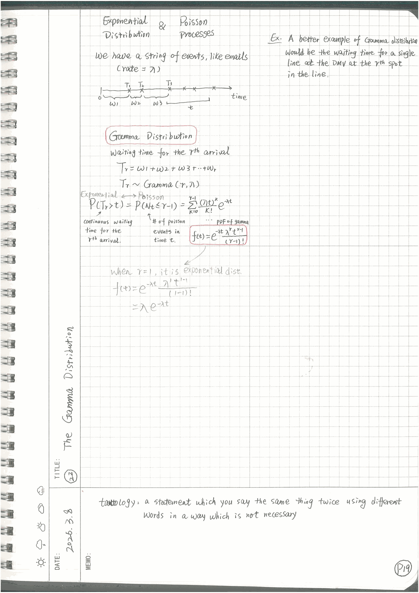

[⬆ Back to index](#episode-index)

---

### Episodes 23 & 24: Functions of a Random Variable / Rescaling the Normal Distribution to Mean Zero and Variance One

**Episode 23: Functions of a Random Variable**

▶️ [Watch on YouTube](https://www.youtube.com/watch?v=hC2idx2-GME&list=PLMrJAkhIeNNR3sNYvfgiKgcStwuPSts9V&index=23)

> One of the most important concepts in probability is that of a function of a random variable. For example, the mean and variance are both functions of a random variable.

**Episode 24: Rescaling the Normal Distribution to Mean Zero and Variance One**

▶️ [Watch on YouTube](https://www.youtube.com/watch?v=pm4si2u-ZC4&list=PLMrJAkhIeNNR3sNYvfgiKgcStwuPSts9V&index=24)

> The normal distribution is a cornerstone of probability, especially given that the sum of distributions tends to converge to a normal. Rescaling a normal distribution with an arbitrary mean and standard deviation to the "unit normal" distribution with mean zero and standard deviation 1 is an important step in computing probabilities.

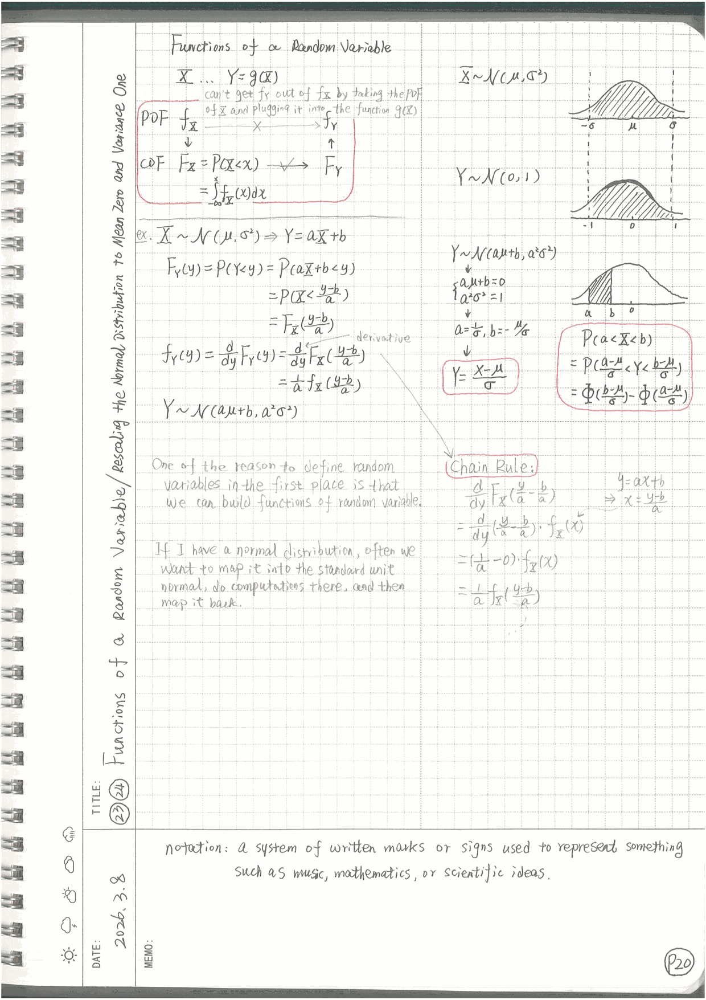

[⬆ Back to index](#episode-index)

---

### Episode 25: The Chi Squared Distribution: The Square of the Normal Distribution

▶️ [Watch on YouTube](https://www.youtube.com/watch?v=h9j849vAsAA&list=PLMrJAkhIeNNR3sNYvfgiKgcStwuPSts9V&index=25)

> Here we introduce the Chi-squared distribution, which is the distribution of Z=X^2 when X is a Gaussian random variable. Chi squared will be very useful when comparing two distributions in statistics to see if data is consistent with a given distribution.

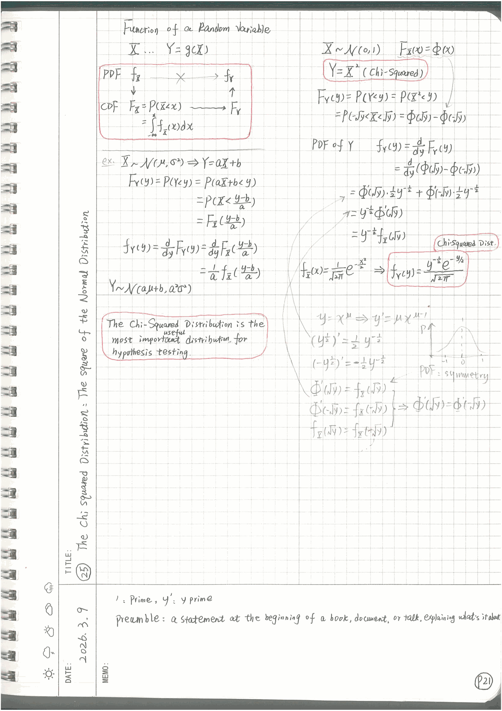

[⬆ Back to index](#episode-index)

---

### Episode 26: Joint Probability Distributions

▶️ [Watch on YouTube](https://www.youtube.com/watch?v=NBo5bXIX7Ac&list=PLMrJAkhIeNNR3sNYvfgiKgcStwuPSts9V&index=26)

> The joint probability distribution quantifies the joint dependence between two random variables, X and Y. If these random variables are independent, then P(X=x,Y=y) = P(X=x)P(Y=y).

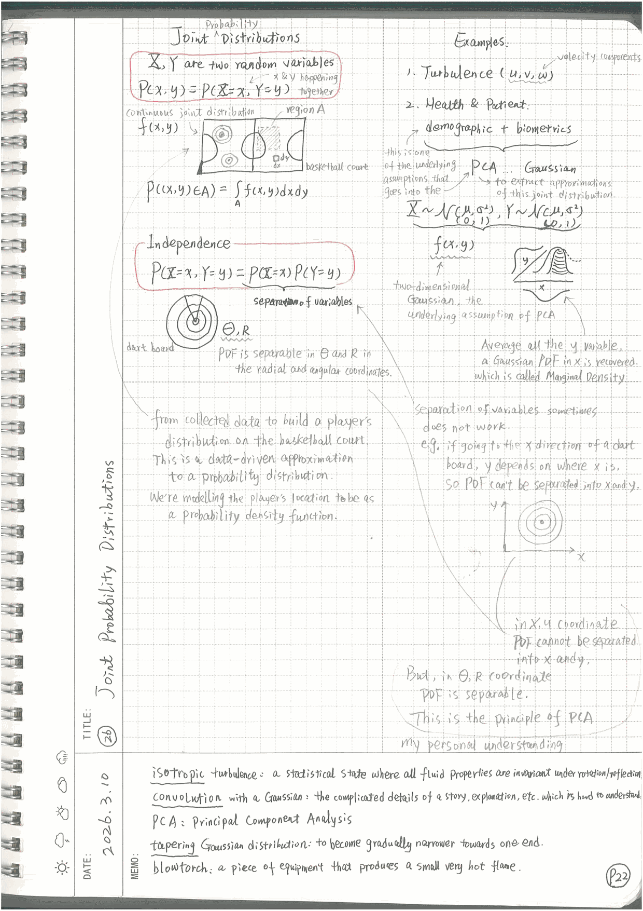

[⬆ Back to index](#episode-index)

---

### Episode 27: Joint Probability Distributions: Marginal and Conditional Densities

▶️ [Watch on YouTube](https://www.youtube.com/watch?v=pribJ8bUBzo&list=PLMrJAkhIeNNR3sNYvfgiKgcStwuPSts9V&index=27)

> Here we introduce two distributions derived from the joint PDF: the marginal and conditional densities. These are especially useful in Bayesian statistics, and also help us bring ideas from Calculus into probability.

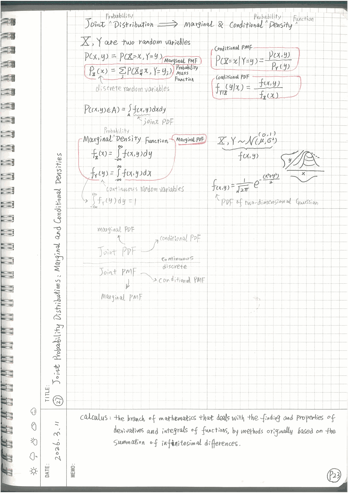

[⬆ Back to index](#episode-index)

---

### Episode 28: The Expected Value (Mean) of a Probability Distribution

▶️ [Watch on YouTube](https://www.youtube.com/watch?v=CBgCR1kHSUI&list=PLMrJAkhIeNNR3sNYvfgiKgcStwuPSts9V&index=28)

> The expected value (aka the mean) of a probability distribution is one of the most important functions of a random variable. The mean can be estimated statistically from data samples and may also be used to compare two distributions.

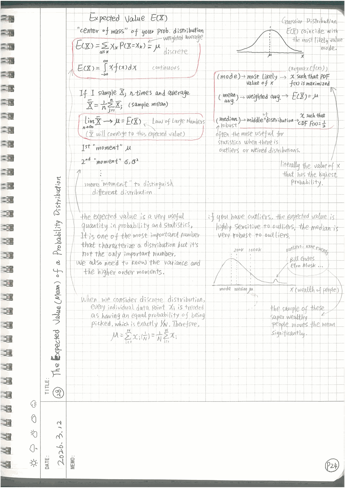

[⬆ Back to index](#episode-index)

---

### Episodes 29 & 30: Properties of the Expected Value / Variance and Standard Deviation

**Episode 29: Properties of the Expected Value**

▶️ [Watch on YouTube](https://www.youtube.com/watch?v=8rnzHE2UtoM&list=PLMrJAkhIeNNR3sNYvfgiKgcStwuPSts9V&index=29)

> This video explores several important properties of the expected value of a random variable. For example, the expected value of the product of two independent random variables is the product of their individual expected values.

**Episode 30: Variance and Standard Deviation**

▶️ [Watch on YouTube](https://www.youtube.com/watch?v=dmSRMYQsM8w&list=PLMrJAkhIeNNR3sNYvfgiKgcStwuPSts9V&index=30)

> Variance and standard deviation measure the spread of a probability distribution, and are very useful quantities in probability and statistics.

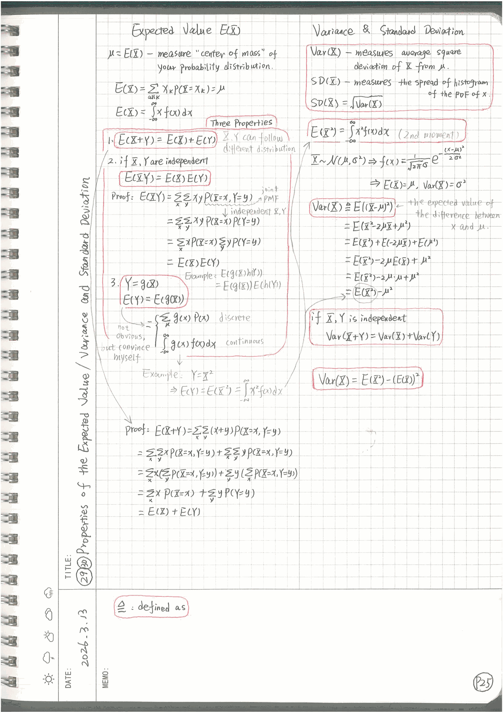

[⬆ Back to index](#episode-index)

---

### Episode 31: Example of Computing the Expectation and Variance of an Exponential Distribution

▶️ [Watch on YouTube](https://www.youtube.com/watch?v=Fz9_yqdEt-I&list=PLMrJAkhIeNNR3sNYvfgiKgcStwuPSts9V&index=31)

> In this video, we compute the expectation and variance of the simple exponential distribution, to illustrate how these calculations work.

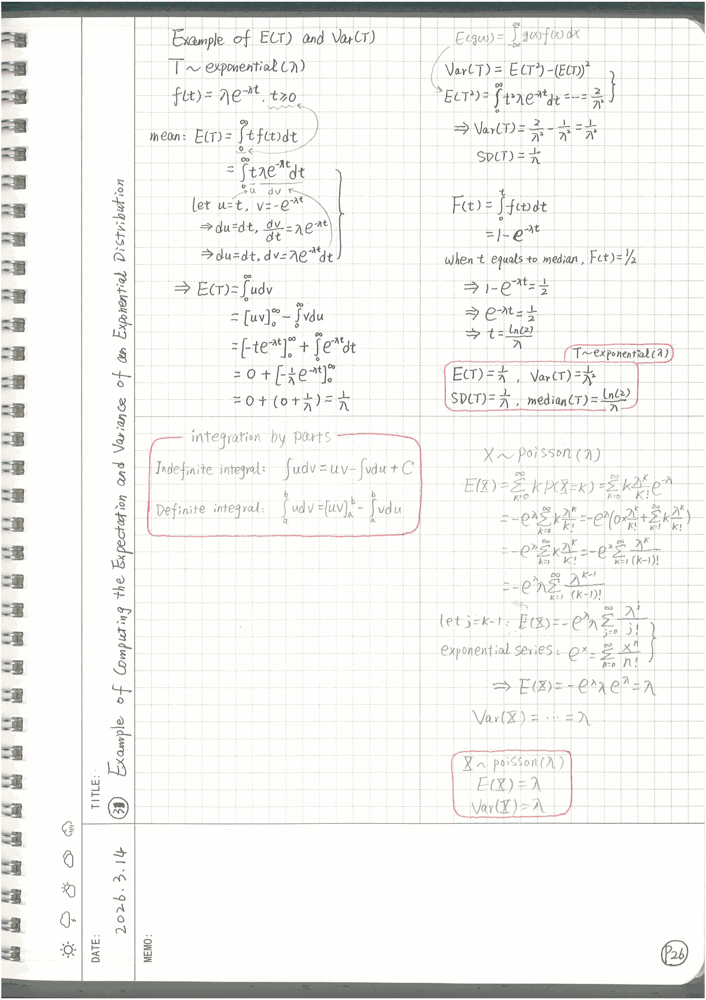

[⬆ Back to index](#episode-index)

---

### Episode 32: Two Examples of Expected Values & Functions: Temperature in C vs F, and the Kinetic Theory of Gases

▶️ [Watch on YouTube](https://www.youtube.com/watch?v=fB6-lCdkEdQ&list=PLMrJAkhIeNNR3sNYvfgiKgcStwuPSts9V&index=32)

> Two useful engineering examples of functions of a random variable arise in gas dynamics. First, we explore the simple conversion of temperature between C and F, and next we explore the temperature as derived from Maxwell's distribution.

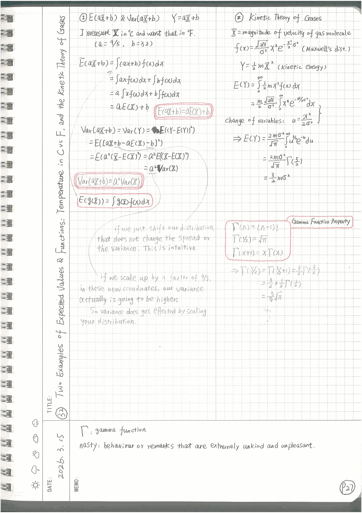

[⬆ Back to index](#episode-index)

---

### Episodes 33 & 34: Markov's Inequality in Probability: First Order Estimates / Chebyshev's Inequality in Probability: Second Order Estimates

**Episode 33: Markov's Inequality in Probability: First Order Estimates**

▶️ [Watch on YouTube](https://www.youtube.com/watch?v=onZSWfbTeho&list=PLMrJAkhIeNNR3sNYvfgiKgcStwuPSts9V&index=33)

> Here we explore Markov's inequality, one of the most important theoretical results in probability. Markov's inequality provides a tight bound on the cumulative distribution function in terms of the expected value of a random variable.

**Episode 34: Chebyshev's Inequality in Probability: Second Order Estimates**

▶️ [Watch on YouTube](https://www.youtube.com/watch?v=otCHN3s52ho&list=PLMrJAkhIeNNR3sNYvfgiKgcStwuPSts9V&index=34)

> Here we explore Chebyshev's inequality, another important theoretical result that provides a bound on the PDF in terms of the variance of a random variable.

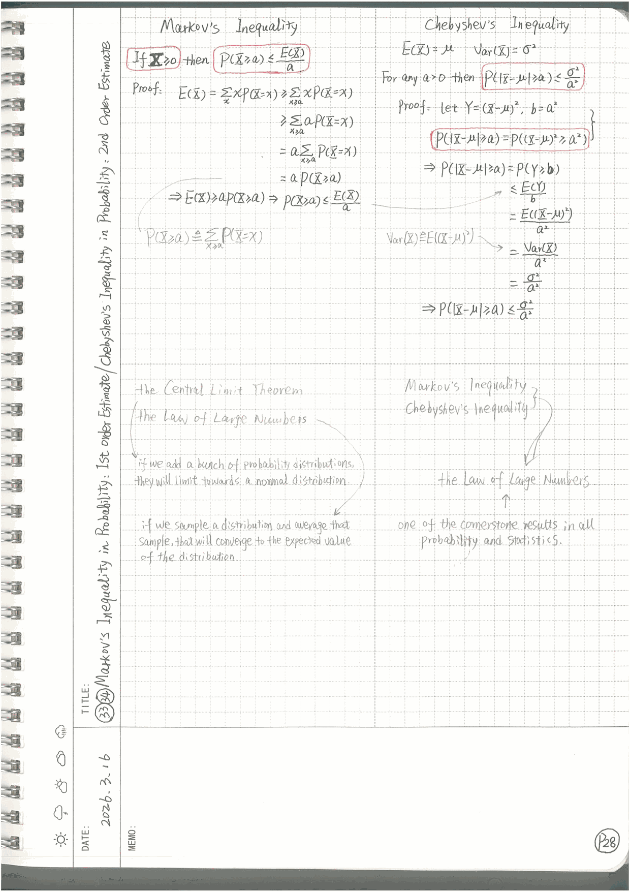

[⬆ Back to index](#episode-index)

---

### Episodes 35 & 36: The Law of Large Numbers / The Central Limit Theorem

**Episode 35: The Law of Large Numbers**

▶️ [Watch on YouTube](https://www.youtube.com/watch?v=0VoRWJMt6mk&list=PLMrJAkhIeNNR3sNYvfgiKgcStwuPSts9V&index=35)

> This video explores the law of large numbers, which is an important result in probability and provides a baby step towards the central limit theorem. This is the basis of much of statistical analysis too, saying that the sample mean of a number of i.i.d. random variables will converge to the mean of the individual random variables.

**Episode 36: The Central Limit Theorem**

▶️ [Watch on YouTube](https://www.youtube.com/watch?v=ckkrS752tjU&list=PLMrJAkhIeNNR3sNYvfgiKgcStwuPSts9V&index=36)

> Here we introduce one of the most important results in probability and statistics: the central limit theorem. The theorem states that under mild assumptions, the sum of i.i.d. random variables tends to converge to a normal distribution. This is useful in a number of scenarios including in survey sampling in statistics.

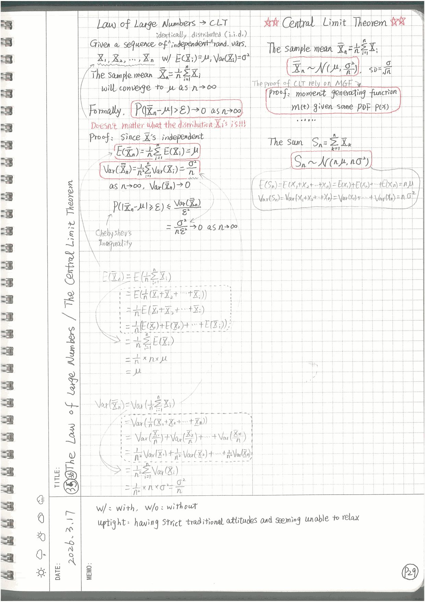

[⬆ Back to index](#episode-index)

---

### Episode 37: The Moment Generating Function

▶️ [Watch on YouTube](https://www.youtube.com/watch?v=u0ku4bvp40I&list=PLMrJAkhIeNNR3sNYvfgiKgcStwuPSts9V&index=37)

> The moment generating function is an important advanced concept in probability. Much like functions can be expanded in a Taylor series, probability densities can be expanded in terms of the moment generating function. The MGF is the Laplace transform of the PDF. This concept is very useful to prove the central limit theorem.

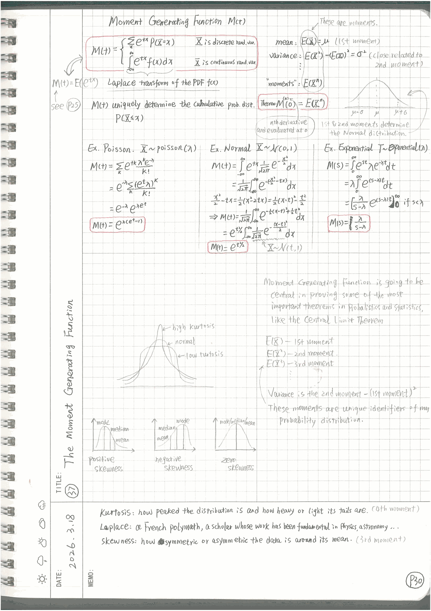

[⬆ Back to index](#episode-index)

---

### Episode 38: Example of The Moment Generating Function

▶️ [Watch on YouTube](https://www.youtube.com/watch?v=JjaOtHaDy9E&list=PLMrJAkhIeNNR3sNYvfgiKgcStwuPSts9V&index=38)

> Here we compute the moment generating function for a simple Poisson distribution. This example demonstrates the mechanics of how this might be computed for other distributions.

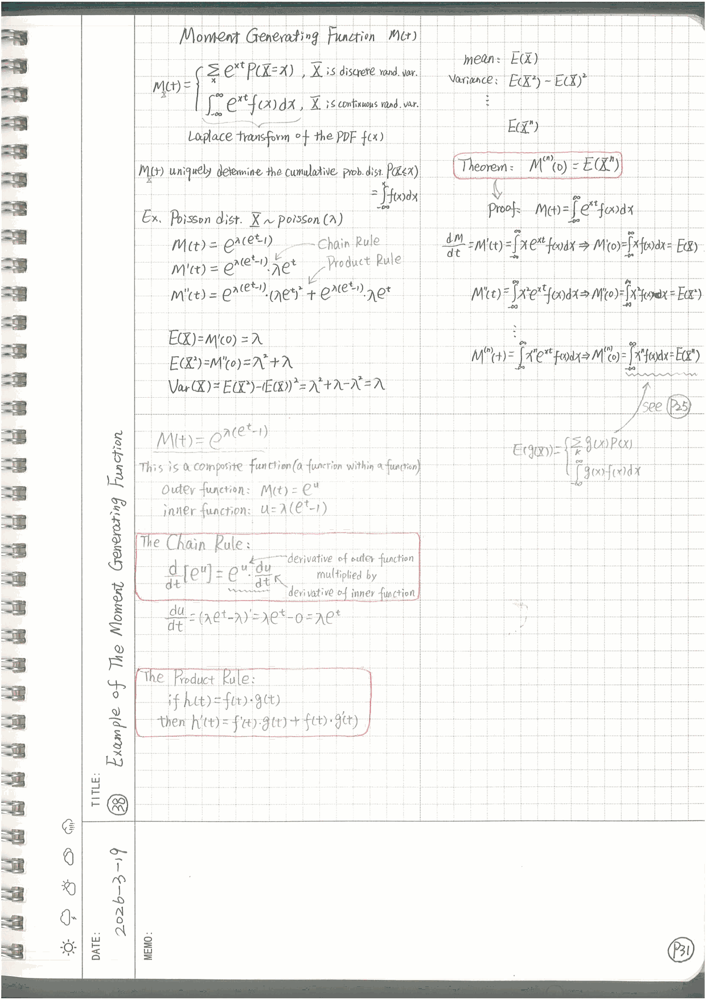

[⬆ Back to index](#episode-index)

---

### Episodes 39 & 40: The Lebesgue Measure in Probability / Additive Property of the Moment Generating Function

**Episode 39: The Lebesgue Measure in Probability**

▶️ [Watch on YouTube](https://www.youtube.com/watch?v=j6AD6Dm9sSs&list=PLMrJAkhIeNNR3sNYvfgiKgcStwuPSts9V&index=39)

> Here we introduce the Lebesgue measure, an important advanced concept in probability for measuring more exotic distributions.

**Episode 40: Additive Property of the Moment Generating Function**

▶️ [Watch on YouTube](https://www.youtube.com/watch?v=rn655n2JtgI&list=PLMrJAkhIeNNR3sNYvfgiKgcStwuPSts9V&index=40)

> Here we demonstrate the additive property of the moment generating function, which is induced from the fact that the MGF is the Laplace transform of the PDF. Specifically given two random variables X and Y, with MGFs M_X and M_Y, then the random variable Z = X + Y has MGF M_X * M_Y.

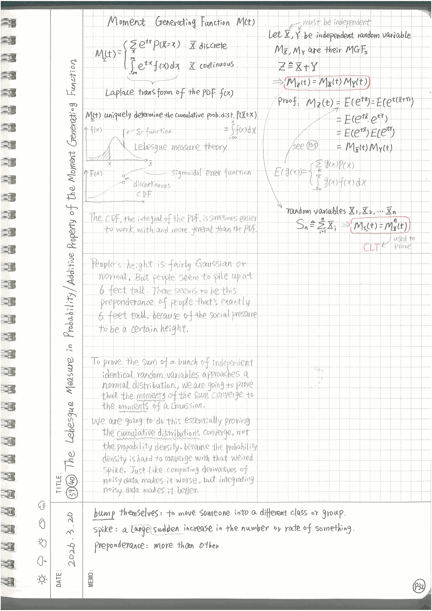

[⬆ Back to index](#episode-index)

---

### Episodes 41 & 42: Covariance and Correlation in Probability / Covariance and Correlation: Example with Gaussian Distributions

**Episode 41: Covariance and Correlation in Probability**

▶️ [Watch on YouTube](https://www.youtube.com/watch?v=QKPdk57y7Ck&list=PLMrJAkhIeNNR3sNYvfgiKgcStwuPSts9V&index=41)

> The covariance and correlation between two random variables is an important concept in probability and statistics that generalizes to data science and machine learning, especially for higher dimensional systems.

**Episode 42: Covariance and Correlation: Example with Gaussian Distributions**

▶️ [Watch on YouTube](https://www.youtube.com/watch?v=upPn685IU_Q&list=PLMrJAkhIeNNR3sNYvfgiKgcStwuPSts9V&index=42)

> Here we explore some simple examples of covariance and correlation of random variables.

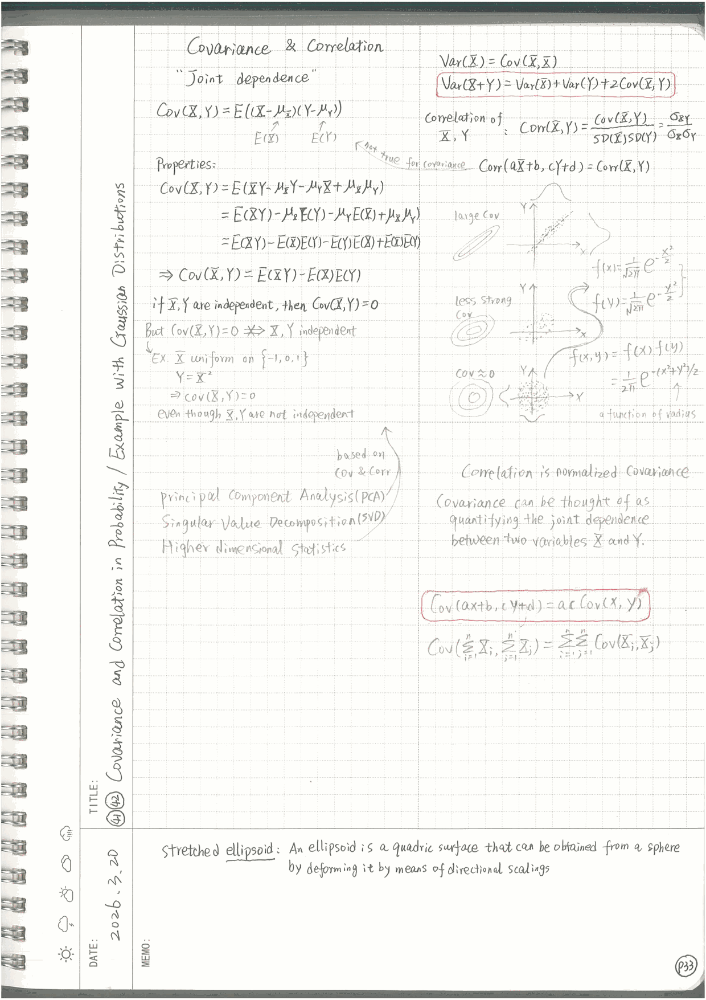

[⬆ Back to index](#episode-index)

---

### Episode 43: The Tail Sum Formula in Probability

▶️ [Watch on YouTube](https://www.youtube.com/watch?v=XQYkD_fct1A&list=PLMrJAkhIeNNR3sNYvfgiKgcStwuPSts9V&index=43)

> The tail sum formula is a useful formula in probability for computing cumulative distribution functions.

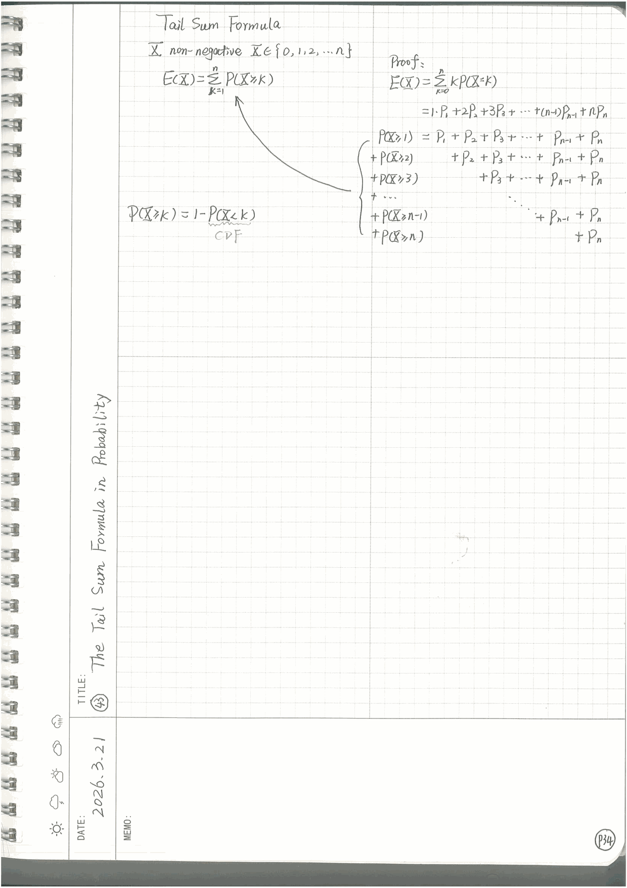

[⬆ Back to index](#episode-index)

---

### Episode 44: Proof of the Central Limit Theorem

▶️ [Watch on YouTube](https://www.youtube.com/watch?v=nWadI0_u6QU&list=PLMrJAkhIeNNR3sNYvfgiKgcStwuPSts9V&index=44)

> Here we use the moment generating function to prove the central limit theorem. This is one of the most important results in probability, and the proof provides deep insight into why it is true.

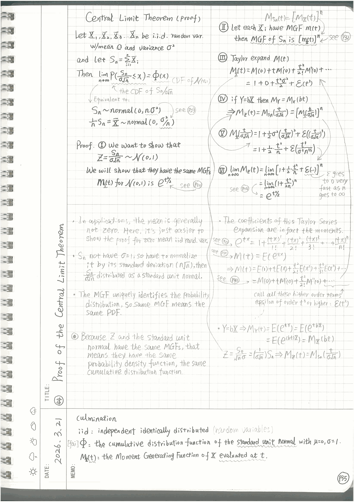

[⬆ Back to index](#episode-index)

---

## Acknowledgments

All course content, episode titles and descriptions belong to Dr. Steve Brunton. These notes are shared for educational purposes only. Please watch the original videos and support his channel.
