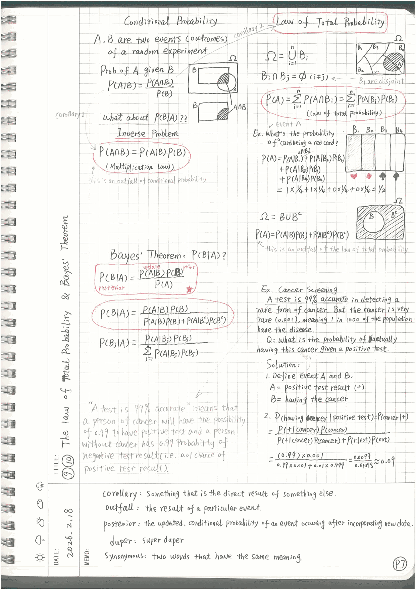
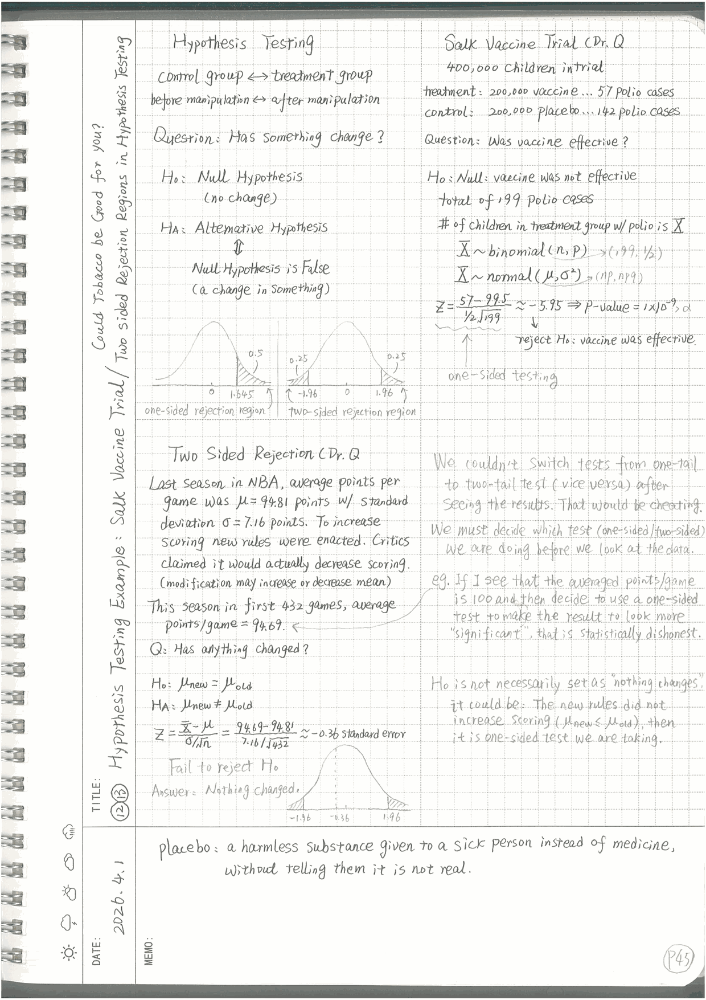

# Dr. Brunton's Probability & Statistics Course Materials

  
  &nbsp;
  
   
  <em>✍️ Sample pages of the hand-written notes. Left: Probability Bootcamp, Episodes 9 &amp; 10 (Law of Total Probability / Bayes' Theorem). Right: Statistics and Data Analysis, Episodes 12 &amp; 13 (Hypothesis Testing). Click a page to see it alongside the video.</em>

This repository contains my hand-written lecture notes and Python notebooks from Dr. Steve Brunton's YouTube courses **Probability Bootcamp** and **Introduction to Statistics and Data Analysis**. These materials are designed to help learners understand fundamental concepts in probability theory and statistical analysis through both theoretical explanations and practical Python implementations.

## 📚 Contents

### Hand-Written Notes

The notes are organized episode by episode. Each page links to the original video and includes the episode's short description:

| Course | Notes by episode | Full notes (PDF) |
|:-------|:-----------------|:-----------------|
| [Probability Bootcamp](https://www.youtube.com/playlist?list=PLMrJAkhIeNNR3sNYvfgiKgcStwuPSts9V) (44 episodes) | [Probability_Bootcamp_Notes.md](Probability_Bootcamp_Notes.md) | [Google Drive](https://drive.google.com/file/d/16eFszC2ff-S5G0cvsu3_dxtKBDFcjOnn/view?usp=sharing) |
| [Introduction to Statistics and Data Analysis](https://www.youtube.com/playlist?list=PLMrJAkhIeNNT14qn1c5qdL29A1UaHamjx) (35 episodes) | [Statistics_and_Data_Analysis_Notes.md](Statistics_and_Data_Analysis_Notes.md) | [Google Drive](https://drive.google.com/file/d/1ZsknKsvAKQbf8-VmSXXBOJ4IpXpFjyQT/view?usp=sharing) |

The page images are stored in [`hand_notes_PB/`](hand_notes_PB) and [`hand_notes_SDA/`](hand_notes_SDA). Most of the notes are identically copied from the notes shown in the course videos. Some supplementary notes are added to clarify the concepts. In addition, there are some terminology interpretations which you might find stupid. But please have mercy on me because I'm not a native English speaker.

### Python Notebooks (Jupyter)

The Jupyter Notebook (`.ipynb`) files contain Python scripts identical to those used by Dr. Brunton during his lectures. The number in each file name is the episode number in the corresponding playlist.

#### Probability Bootcamp (PB)

- [PB05_The Birthday Problem in Probability](PB05_The%20Birthday%20Problem%20in%20Probability.ipynb)
- [PB06_Quality Control, Non-destructive Inspection, and the Hypergeometric Distribution](PB06_Quality%20Control%2C%20Non-destructive%20Inspection%2C%20and%20the%20Hypergeometric%20Distribution.ipynb)
- [PB07_The Binomial Distribution and the Multinomial Distribution](PB07_The%20Binomial%20Distribution%20and%20the%20Multinomial%20Distribution.ipynb)
- [PB15_The Normal Distribution- The Limit of Binomial Distribution for Large n](PB15_The%20Normal%20Distribution-%20The%20Limit%20of%20Binomial%20Distribution%20for%20Large%20n.ipynb)
- [PB16_The Standard Unit Normal and Probability Computation](PB16_The%20Standard%20Unit%20Normal%20and%20Probability%20Computation.ipynb)
- [PB17_The Poisson Distribution- the Rare Event Limit of a Binomial Distribution](PB17_The%20Poisson%20Distribution-%20the%20Rare%20Event%20Limit%20of%20a%20Binomial%20Distribution.ipynb)

#### Statistics and Data Analysis (SDA)

- [SDA02_Population Statistics and Random Sampling](SDA02_Population%20Statistics%20and%20Random%20Sampling.ipynb)
- [SDA06_Normal Approximation to Sample Mean](SDA06_Normal%20Approximation%20to%20Sample%20Mean.ipynb)
- [SDA14_P-hacking](SDA14_P-hacking.ipynb)
- [SDA15_Parameter Estimation and Fitting Distributions](SDA15_Parameter%20Estimation%20and%20Fitting%20Distributions.ipynb)
- [SDA18_Bootstrapping and Monte Carlo Sampling in Statistics](SDA18_Bootstrapping%20and%20Monte%20Carlo%20Sampling%20in%20Statistics.ipynb)
- [SDA24_The Chi-squared Test](SDA24_The%20Chi-squared%20Test.ipynb)
- [SDA25_Students t-distribution in Statistics](SDA25_Students%20t-distribution%20in%20Statistics.ipynb)
- [SDA28_Bayesian Inference- Overview](SDA28_Bayesian%20Inference-%20Overview.ipynb)
- [SDA31_Density Estimation with GMMs and Empirical Priors](SDA31_Density%20Estimation%20with%20GMMs%20and%20Empirical%20Priors.ipynb)
- [SDA32_Monte Carlo Sampling and Bootstrapping in Bayesian Inference](SDA32_Monte%20Carlo%20Sampling%20and%20Bootstrapping%20in%20Bayesian%20Inference.ipynb)

## 🚀 How to Use

1. **Notes**: open [Probability_Bootcamp_Notes.md](Probability_Bootcamp_Notes.md) or [Statistics_and_Data_Analysis_Notes.md](Statistics_and_Data_Analysis_Notes.md), use the episode index to jump to a topic, and watch the linked video alongside the notes. If you prefer to read offline, download the full PDFs from Google Drive.
2. **Jupyter Notebooks**: click on any `.ipynb` file to view the rendered notebook on GitHub, or download it and run it locally with Jupyter (`pip install notebook numpy scipy matplotlib`).

## 📖 Learning Path

For beginners, we recommend following this sequence:

1. Start with the **Probability Bootcamp (PB)** notes and notebooks to build foundational knowledge
2. Progress to the **Statistics and Data Analysis (SDA)** notes and notebooks
3. Cross-reference each notebook with the notes for the same episode

## 💡 Tips for Learners

- Run each notebook cell-by-cell to understand the flow of computations
- Modify parameters in the code to see how results change
- Cross-reference the notes with the notebooks for deeper understanding
- Take notes on key concepts and formulas as you progress

## 📄 License

These materials are provided for educational purposes. All course content belongs to Dr. Steve Brunton. Please respect intellectual property rights and use these resources responsibly for personal learning and study.

## 🙏 Acknowledgments

Special thanks to Dr. Brunton for creating these comprehensive courses and making them available for learners worldwide.

---

**Happy Learning!** 🎓

If you find these materials helpful, consider starring this repository to help others discover these valuable resources.
