# Statistics and Data Analysis: Hand-Written Notes

Hand-written study notes for **Introduction to Statistics and Data Analysis** by [Dr. Steve Brunton](https://www.youtube.com/@Eigensteve) (University of Washington), the second playlist of his YouTube course on *Probability and Statistics*.

- Playlist: [Introduction to Statistics and Data Analysis on YouTube](https://www.youtube.com/playlist?list=PLMrJAkhIeNNT14qn1c5qdL29A1UaHamjx) (35 episodes)
- Full notes as PDF: [Statistics_and_Data_Analysis_Notes.pdf](https://drive.google.com/file/d/1ZsknKsvAKQbf8-VmSXXBOJ4IpXpFjyQT/view?usp=sharing) (Google Drive)
- Companion notes: [Probability Bootcamp notes](Probability_Bootcamp_Notes.md)
- Back to the [repository README](README.md)

## About the Course

> This video provides a high level overview of this new short course on Statistics. Statistics is the process of learning a probability distribution, given data, and it is a foundation of machine learning.
>
> — from the description of *Introduction to Statistics and Data Analysis*

Where probability assumes the distribution is known and asks about the data, statistics starts from data and works back to the distribution. The course covers random sampling and the sample mean, confidence intervals, hypothesis testing (errors, rejection regions and p-hacking), parameter estimation (method of moments, bootstrapping, maximum likelihood and MAP), the chi-squared and Student's t tests, and Bayesian inference, from conjugate priors and Gaussian mixture models to Bayesian linear regression.

## About These Notes

- Each image in [`hand_notes_SDA/`](hand_notes_SDA) is one notebook page. Most pages cover a single episode (e.g. `SDA_Note_Brunton_09.png` → Episode 9); a page whose file name ends with two numbers covers two consecutive episodes (e.g. `SDA_Note_Brunton_10_11.png` → Episodes 10 & 11).
- Most content follows what Dr. Brunton writes in the videos, with some supplementary notes added to clarify concepts. The **MEMO** area at the bottom of each page holds English vocabulary notes.
- ✏️ **A note on legibility:** some parts of the notes (mostly the supplementary explanations) were written in pencil, so they look lighter and are a bit harder to read in the scanned images. My apologies for the inconvenience! If a passage is hard to make out, try zooming in on the image or opening the [full PDF on Google Drive](https://drive.google.com/file/d/1ZsknKsvAKQbf8-VmSXXBOJ4IpXpFjyQT/view?usp=sharing), which has a higher resolution.
- Episodes marked 🐍 have a companion Jupyter notebook in this repository.
- All pages are also compiled in a single [PDF on Google Drive](https://drive.google.com/file/d/1ZsknKsvAKQbf8-VmSXXBOJ4IpXpFjyQT/view?usp=sharing).

## Episode Index

| Ep. | Title | Video | Notes | Python |
|:---:|:------|:-----:|:-----:|:------:|
| 1 | Introduction to Statistics and Data Analysis | [▶️](https://www.youtube.com/watch?v=QIXUTsdj_oA&list=PLMrJAkhIeNNT14qn1c5qdL29A1UaHamjx&index=1) | [📝](#ep-01) |  |
| 2 | Population Statistics and Random Sampling | [▶️](https://www.youtube.com/watch?v=OlkL1YatyHI&list=PLMrJAkhIeNNT14qn1c5qdL29A1UaHamjx&index=2) | [📝](#ep-02) | [🐍](SDA02_Population%20Statistics%20and%20Random%20Sampling.ipynb) |
| 3 | Random Sampling in Statistics: Expected Value and Variance of the Sample Mean | [▶️](https://www.youtube.com/watch?v=Gg3d-rn9eEU&list=PLMrJAkhIeNNT14qn1c5qdL29A1UaHamjx&index=3) | [📝](#ep-03) |  |
| 4 | Random Sampling Without Replacement (Finite "n" Correction) | [▶️](https://www.youtube.com/watch?v=IDvp3pMm16k&list=PLMrJAkhIeNNT14qn1c5qdL29A1UaHamjx&index=4) | [📝](#ep-04) |  |
| 5 | Sample Variance in Random Population Sampling | [▶️](https://www.youtube.com/watch?v=yNnUVHfX5yQ&list=PLMrJAkhIeNNT14qn1c5qdL29A1UaHamjx&index=5) | [📝](#ep-05) |  |
| 6 | Normal Approximation to Sample Mean | [▶️](https://www.youtube.com/watch?v=Arbj9SoU9Cs&list=PLMrJAkhIeNNT14qn1c5qdL29A1UaHamjx&index=6) | [📝](#ep-06) | [🐍](SDA06_Normal%20Approximation%20to%20Sample%20Mean.ipynb) |
| 7 | Confidence Intervals | [▶️](https://www.youtube.com/watch?v=qTVdV8ITZfk&list=PLMrJAkhIeNNT14qn1c5qdL29A1UaHamjx&index=7) | [📝](#ep-07-08) |  |
| 8 | Central Limit Theorem Example & Hypothesis Testing | [▶️](https://www.youtube.com/watch?v=bOrihOzYXWA&list=PLMrJAkhIeNNT14qn1c5qdL29A1UaHamjx&index=8) | [📝](#ep-07-08) |  |
| 9 | Hypothesis Testing in Statistics | [▶️](https://www.youtube.com/watch?v=vVDahuv1bq8&list=PLMrJAkhIeNNT14qn1c5qdL29A1UaHamjx&index=9) | [📝](#ep-09) |  |
| 10 | Hypothesis Testing Procedure | [▶️](https://www.youtube.com/watch?v=WYifBkNg1r8&list=PLMrJAkhIeNNT14qn1c5qdL29A1UaHamjx&index=10) | [📝](#ep-10-11) |  |
| 11 | Hypothesis Testing: Type I and Type II Errors | [▶️](https://www.youtube.com/watch?v=129NuU3A7rM&list=PLMrJAkhIeNNT14qn1c5qdL29A1UaHamjx&index=11) | [📝](#ep-10-11) |  |
| 12 | Hypothesis Testing Example: Salk Vaccine Trial | [▶️](https://www.youtube.com/watch?v=V3aYG8mLmkI&list=PLMrJAkhIeNNT14qn1c5qdL29A1UaHamjx&index=12) | [📝](#ep-12-13) |  |
| 13 | Could Tobacco be Good for you? Two Sided Rejection Regions in Hypothesis Testing | [▶️](https://www.youtube.com/watch?v=znnim8MTl0c&list=PLMrJAkhIeNNT14qn1c5qdL29A1UaHamjx&index=13) | [📝](#ep-12-13) |  |
| 14 | Lies, Damn Lies, and Statistics... P-Hacking | [▶️](https://www.youtube.com/watch?v=Et9pORQHR2A&list=PLMrJAkhIeNNT14qn1c5qdL29A1UaHamjx&index=14) | [📝](#ep-14) | [🐍](SDA14_P-hacking.ipynb) |
| 15 | Parameter Estimation and Fitting Distributions | [▶️](https://www.youtube.com/watch?v=7XVA2JRzYoE&list=PLMrJAkhIeNNT14qn1c5qdL29A1UaHamjx&index=15) | [📝](#ep-15) | [🐍](SDA15_Parameter%20Estimation%20and%20Fitting%20Distributions.ipynb) |
| 16 | Method of Moments to Fit Distributions from Data | [▶️](https://www.youtube.com/watch?v=IZk0Iq2hI3c&list=PLMrJAkhIeNNT14qn1c5qdL29A1UaHamjx&index=16) | [📝](#ep-16) |  |
| 17 | Error in the Method of Moments | [▶️](https://www.youtube.com/watch?v=341Ecdkfb-s&list=PLMrJAkhIeNNT14qn1c5qdL29A1UaHamjx&index=17) | [📝](#ep-17-18) |  |
| 18 | Bootstrapping and Monte Carlo Sampling in Statistics | [▶️](https://www.youtube.com/watch?v=wsU7YLcPXmE&list=PLMrJAkhIeNNT14qn1c5qdL29A1UaHamjx&index=18) | [📝](#ep-17-18) | [🐍](SDA18_Bootstrapping%20and%20Monte%20Carlo%20Sampling%20in%20Statistics.ipynb) |
| 19 | Maximum Likelihood Estimation (MLE) with Examples | [▶️](https://www.youtube.com/watch?v=rCdxlN6Ph14&list=PLMrJAkhIeNNT14qn1c5qdL29A1UaHamjx&index=19) | [📝](#ep-19-20) |  |
| 20 | Maximum Likelihood Estimation Example: Fitting a Normal Distribution with Data | [▶️](https://www.youtube.com/watch?v=x5GOUgCTkjM&list=PLMrJAkhIeNNT14qn1c5qdL29A1UaHamjx&index=20) | [📝](#ep-19-20) |  |
| 21 | Properties of Maximum Likelihood Estimation | [▶️](https://www.youtube.com/watch?v=QVF0oOh7s8c&list=PLMrJAkhIeNNT14qn1c5qdL29A1UaHamjx&index=21) | [📝](#ep-21) |  |
| 22 | Bayesian Maximum Aposteriori Estimation (MAP): Extending Maximum Likelihood Estimation | [▶️](https://www.youtube.com/watch?v=xgfexqYxrDU&list=PLMrJAkhIeNNT14qn1c5qdL29A1UaHamjx&index=22) | [📝](#ep-22) |  |
| 23 | Consistency of Parameter Estimates in Statistics | [▶️](https://www.youtube.com/watch?v=27wRPAg3H28&list=PLMrJAkhIeNNT14qn1c5qdL29A1UaHamjx&index=23) | [📝](#ep-23) |  |
| 24 | The Chi-Squared Test: Are Two Distributions the Same? (with Python Example) | [▶️](https://www.youtube.com/watch?v=63S3FLISKMs&list=PLMrJAkhIeNNT14qn1c5qdL29A1UaHamjx&index=24) | [📝](#ep-24) | [🐍](SDA24_The%20Chi-squared%20Test.ipynb) |
| 25 | Student's t-distribution in Statistics | [▶️](https://www.youtube.com/watch?v=kQoPUR0hQNo&list=PLMrJAkhIeNNT14qn1c5qdL29A1UaHamjx&index=25) | [📝](#ep-25) | [🐍](SDA25_Students%20t-distribution%20in%20Statistics.ipynb) |
| 26 | Hypothesis Testing Revisited: Normal, t, and Chi-Squared Distribution Tests | [▶️](https://www.youtube.com/watch?v=u793OrRvZBk&list=PLMrJAkhIeNNT14qn1c5qdL29A1UaHamjx&index=26) | [📝](#ep-26-27) |  |
| 27 | Properties of Chi-Squared and Student's t Distributions | [▶️](https://www.youtube.com/watch?v=so04ygeccwk&list=PLMrJAkhIeNNT14qn1c5qdL29A1UaHamjx&index=27) | [📝](#ep-26-27) |  |
| 28 | Bayesian Inference: Overview | [▶️](https://www.youtube.com/watch?v=XCEpIBqKogo&list=PLMrJAkhIeNNT14qn1c5qdL29A1UaHamjx&index=28) | [📝](#ep-28) | [🐍](SDA28_Bayesian%20Inference-%20Overview.ipynb) |
| 29 | Bayesian Updates and Conjugate Priors | [▶️](https://www.youtube.com/watch?v=GqSX-8AQL90&list=PLMrJAkhIeNNT14qn1c5qdL29A1UaHamjx&index=29) | [📝](#ep-29) |  |
| 30 | Conjugate Priors Example: Normal Distribution and the Exponential Family of Distributions | [▶️](https://www.youtube.com/watch?v=q8ypTSQotXQ&list=PLMrJAkhIeNNT14qn1c5qdL29A1UaHamjx&index=30) | [📝](#ep-30) |  |
| 31 | Density Estimation with Gaussian Mixture Models (GMM) and Empirical Priors | [▶️](https://www.youtube.com/watch?v=a1pvm1QGXYg&list=PLMrJAkhIeNNT14qn1c5qdL29A1UaHamjx&index=31) | [📝](#ep-31) | [🐍](SDA31_Density%20Estimation%20with%20GMMs%20and%20Empirical%20Priors.ipynb) |
| 32 | Monte Carlo Sampling and Bootstrapping in Bayesian Inference | [▶️](https://www.youtube.com/watch?v=f1Vcc-bPfnU&list=PLMrJAkhIeNNT14qn1c5qdL29A1UaHamjx&index=32) | [📝](#ep-32) | [🐍](SDA32_Monte%20Carlo%20Sampling%20and%20Bootstrapping%20in%20Bayesian%20Inference.ipynb) |
| 33 | Bayesian Linear Regression and Maximum Likelihood Estimates | [▶️](https://www.youtube.com/watch?v=qTRgdhgmFyc&list=PLMrJAkhIeNNT14qn1c5qdL29A1UaHamjx&index=33) | [📝](#ep-33) |  |
| 34 | Bayesian Linear Regression and Maximum a Posteriori (MAP) Estimate | [▶️](https://www.youtube.com/watch?v=wdWHbYdhfG8&list=PLMrJAkhIeNNT14qn1c5qdL29A1UaHamjx&index=34) | [📝](#ep-34) |  |
| 35 | Bayesian Linear Regression [Python Example] | [▶️](https://www.youtube.com/watch?v=GiIxJ5tqGoE&list=PLMrJAkhIeNNT14qn1c5qdL29A1UaHamjx&index=35) | — |  |

## Notes by Episode

### Episode 1: Introduction to Statistics and Data Analysis

▶️ [Watch on YouTube](https://www.youtube.com/watch?v=QIXUTsdj_oA&list=PLMrJAkhIeNNT14qn1c5qdL29A1UaHamjx&index=1)

> This video provides a high level overview of this new short course on Statistics. Statistics is the process of learning a probability distribution, given data, and it is a foundation of machine learning.

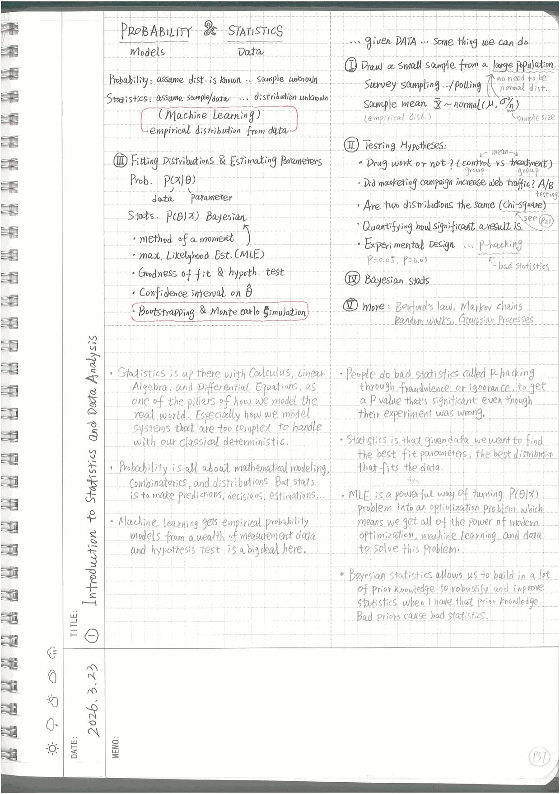

[⬆ Back to index](#episode-index)

---

### Episode 2: Population Statistics and Random Sampling

▶️ [Watch on YouTube](https://www.youtube.com/watch?v=OlkL1YatyHI&list=PLMrJAkhIeNNT14qn1c5qdL29A1UaHamjx&index=2) · 🐍 [Python notebook](SDA02_Population%20Statistics%20and%20Random%20Sampling.ipynb)

> This video introduces the notion of random sampling of a population to determine its statistics. For example, we may estimate the population mean and variance using the sample mean and variance, and we can also quantify the uncertainty in these estimates, depending on the sample size.

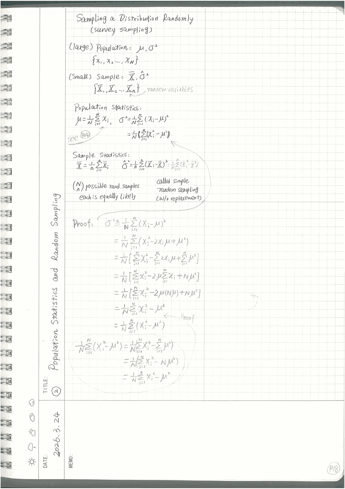

[⬆ Back to index](#episode-index)

---

### Episode 3: Random Sampling in Statistics: Expected Value and Variance of the Sample Mean

▶️ [Watch on YouTube](https://www.youtube.com/watch?v=Gg3d-rn9eEU&list=PLMrJAkhIeNNT14qn1c5qdL29A1UaHamjx&index=3)

> Here we compute the expected value and variance of the sample mean. This will help us understand properties about the larger population, and how it relates to smaller random sampling. This is useful, for example in political polling, drug trials, A/B testing of website designs (and YouTube thumbnails!), and much more!

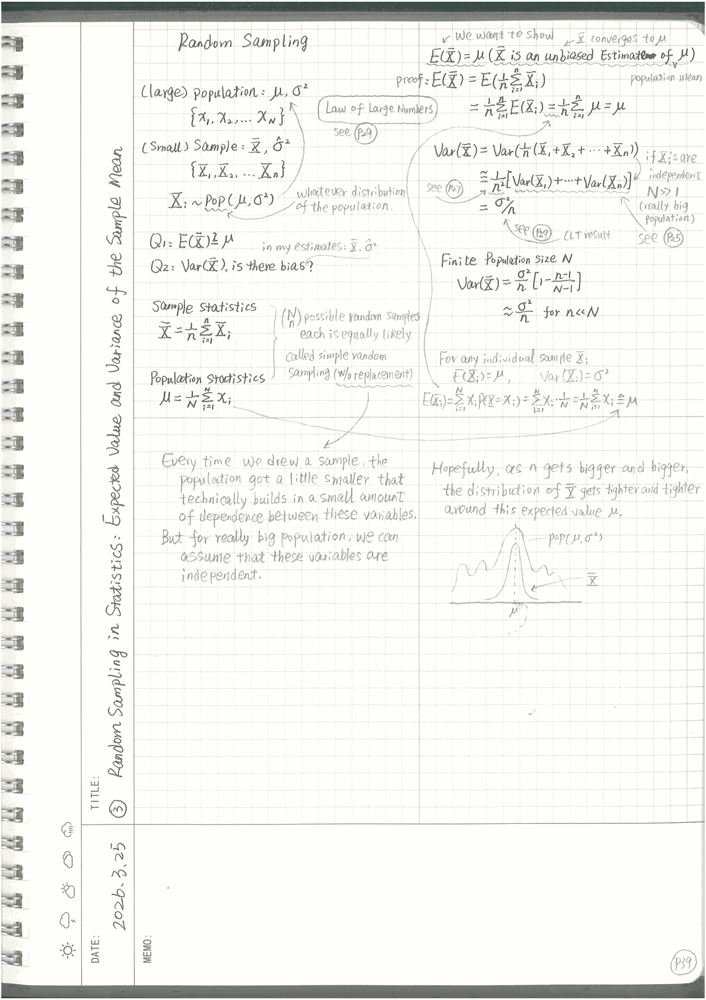

[⬆ Back to index](#episode-index)

---

### Episode 4: Random Sampling Without Replacement (Finite "n" Correction)

▶️ [Watch on YouTube](https://www.youtube.com/watch?v=IDvp3pMm16k&list=PLMrJAkhIeNNT14qn1c5qdL29A1UaHamjx&index=4)

> Until now, we assumed that the population was large. Now we consider the case of a finite sized population. When we randomly sample now, these elements are removed from the candidates and we are sampling "without replacement". This involves a correction.

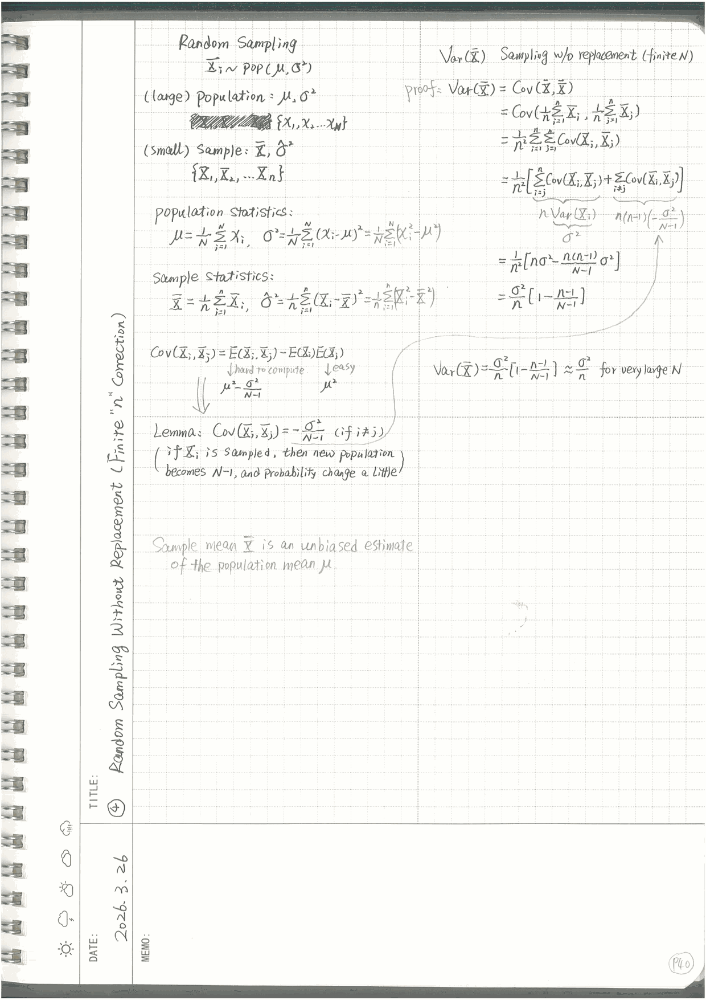

[⬆ Back to index](#episode-index)

---

### Episode 5: Sample Variance in Random Population Sampling

▶️ [Watch on YouTube](https://www.youtube.com/watch?v=yNnUVHfX5yQ&list=PLMrJAkhIeNNT14qn1c5qdL29A1UaHamjx&index=5)

> Here we compute the expected value of the sample variance of a random sample of a larger population. This will further help us understand the properties of the larger population.

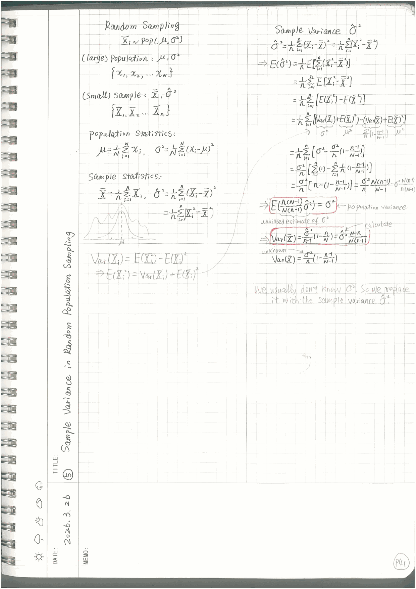

[⬆ Back to index](#episode-index)

---

### Episode 6: Normal Approximation to Sample Mean

▶️ [Watch on YouTube](https://www.youtube.com/watch?v=Arbj9SoU9Cs&list=PLMrJAkhIeNNT14qn1c5qdL29A1UaHamjx&index=6) · 🐍 [Python notebook](SDA06_Normal%20Approximation%20to%20Sample%20Mean.ipynb)

> Here we show that the sample mean is a normally distributed random variable, leveraging ideas from the central limit theorem. This will help us quantify the error of our sample mean approximation, and say things about the larger population.

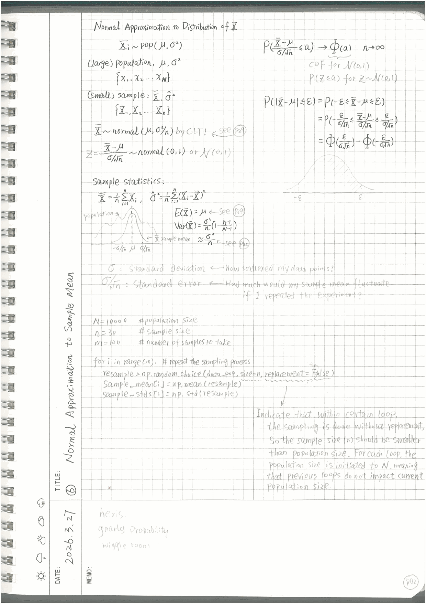

[⬆ Back to index](#episode-index)

---

### Episodes 7 & 8: Confidence Intervals / Central Limit Theorem Example & Hypothesis Testing

**Episode 7: Confidence Intervals**

▶️ [Watch on YouTube](https://www.youtube.com/watch?v=qTVdV8ITZfk&list=PLMrJAkhIeNNT14qn1c5qdL29A1UaHamjx&index=7)

> Confidence intervals are an extremely important, and intuitive, concept in statistics. They allow us to quantify our statistical estimates with uncertainty bounds.

**Episode 8: Central Limit Theorem Example & Hypothesis Testing**

▶️ [Watch on YouTube](https://www.youtube.com/watch?v=bOrihOzYXWA&list=PLMrJAkhIeNNT14qn1c5qdL29A1UaHamjx&index=8)

> Here we introduce the notion of hypothesis testing, which allows us to confirm or reject a hypothesis about the statistical distribution underlying a data set, using confidence intervals and the Central Limit Theorem.

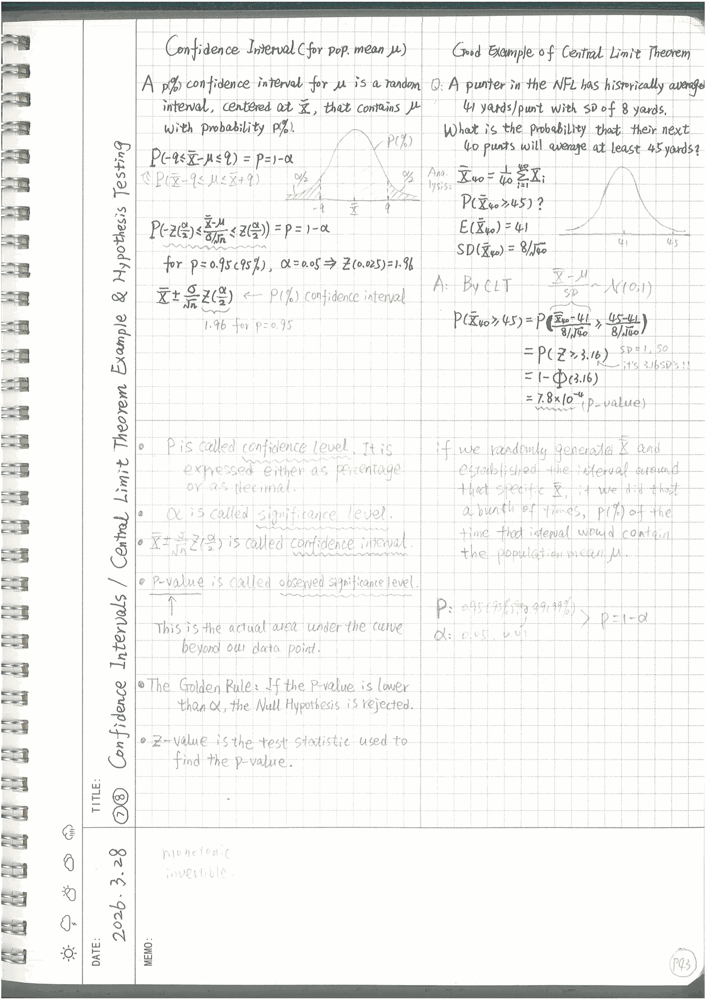

[⬆ Back to index](#episode-index)

---

### Episode 9: Hypothesis Testing in Statistics

▶️ [Watch on YouTube](https://www.youtube.com/watch?v=vVDahuv1bq8&list=PLMrJAkhIeNNT14qn1c5qdL29A1UaHamjx&index=9)

> Hypothesis testing is a powerful statistical technique, where you compute your confidence in a set of observations (data) given a hypothesized statistical model. Then, the hypothesis is either accepted or rejected based on the likelihood.

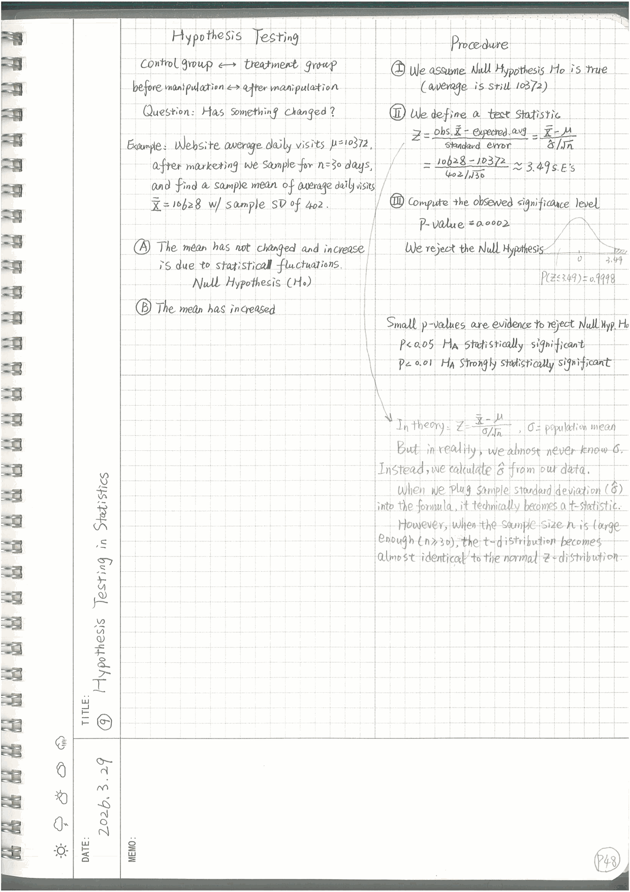

[⬆ Back to index](#episode-index)

---

### Episodes 10 & 11: Hypothesis Testing Procedure / Hypothesis Testing: Type I and Type II Errors

**Episode 10: Hypothesis Testing Procedure**

▶️ [Watch on YouTube](https://www.youtube.com/watch?v=WYifBkNg1r8&list=PLMrJAkhIeNNT14qn1c5qdL29A1UaHamjx&index=10)

> In this video, we explore the process of forming and testing a hypothesis, for example using significant values.

**Episode 11: Hypothesis Testing: Type I and Type II Errors**

▶️ [Watch on YouTube](https://www.youtube.com/watch?v=129NuU3A7rM&list=PLMrJAkhIeNNT14qn1c5qdL29A1UaHamjx&index=11)

> This video discusses the types of errors associated with hypothesis testing in statistics.

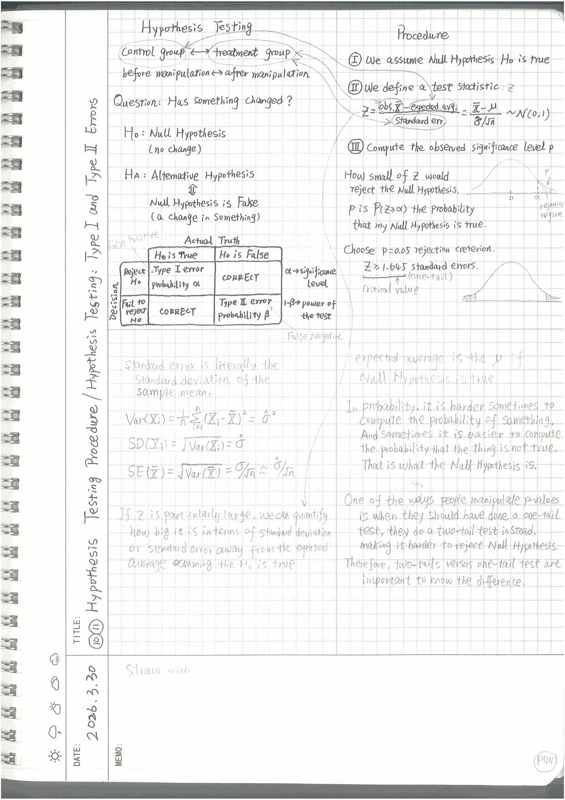

[⬆ Back to index](#episode-index)

---

### Episodes 12 & 13: Hypothesis Testing Example: Salk Vaccine Trial / Could Tobacco be Good for you? Two Sided Rejection Regions in Hypothesis Testing

**Episode 12: Hypothesis Testing Example: Salk Vaccine Trial**

▶️ [Watch on YouTube](https://www.youtube.com/watch?v=V3aYG8mLmkI&list=PLMrJAkhIeNNT14qn1c5qdL29A1UaHamjx&index=12)

> Here we work an example of hypothesis testing in statistics, based on the Salk Vaccine trial.

**Episode 13: Could Tobacco be Good for you? Two Sided Rejection Regions in Hypothesis Testing**

▶️ [Watch on YouTube](https://www.youtube.com/watch?v=znnim8MTl0c&list=PLMrJAkhIeNNT14qn1c5qdL29A1UaHamjx&index=13)

> One of the curious aspects of hypothesis testing is that you can choose a one-sided or two-sided rejection region. This has broad implications. For example, we may want to design a clinical study to see if tobacco is unhealthy, which is a one-sided test. But if we entertain the chance that it may be good for you, we must develop a two-sided test, which has different rejection criteria.

[⬆ Back to index](#episode-index)

---

### Episode 14: Lies, Damn Lies, and Statistics... P-Hacking

▶️ [Watch on YouTube](https://www.youtube.com/watch?v=Et9pORQHR2A&list=PLMrJAkhIeNNT14qn1c5qdL29A1UaHamjx&index=14) · 🐍 [Python notebook](SDA14_P-hacking.ipynb)

> This video discusses how to misuse hypothesis testing, accidentally or intentionally, by p-hacking and other forms of bad statistics.

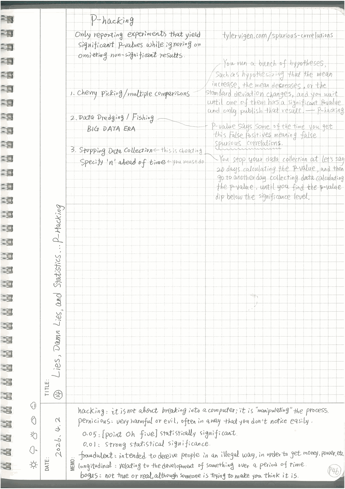

[⬆ Back to index](#episode-index)

---

### Episode 15: Parameter Estimation and Fitting Distributions

▶️ [Watch on YouTube](https://www.youtube.com/watch?v=7XVA2JRzYoE&list=PLMrJAkhIeNNT14qn1c5qdL29A1UaHamjx&index=15) · 🐍 [Python notebook](SDA15_Parameter%20Estimation%20and%20Fitting%20Distributions.ipynb)

> This video introduces the concept of parameter estimation in statistics, on a simple example of radioactive decay.

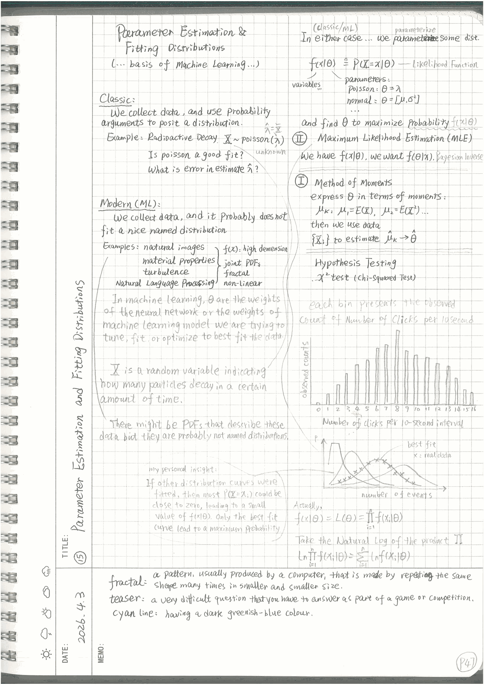

[⬆ Back to index](#episode-index)

---

### Episode 16: Method of Moments to Fit Distributions from Data

▶️ [Watch on YouTube](https://www.youtube.com/watch?v=IZk0Iq2hI3c&list=PLMrJAkhIeNNT14qn1c5qdL29A1UaHamjx&index=16)

> The method of moments is one of the simplest and most intuitive methods to fit the parameters of a probability distribution from data. In the method of moments, we approximate the moments of the distribution in terms of sample data (e.g., sample mean, sample variance, etc.), and then use these moments to solve for the unknown parameters (e.g., the decay rate lambda in a Poisson model, etc.)

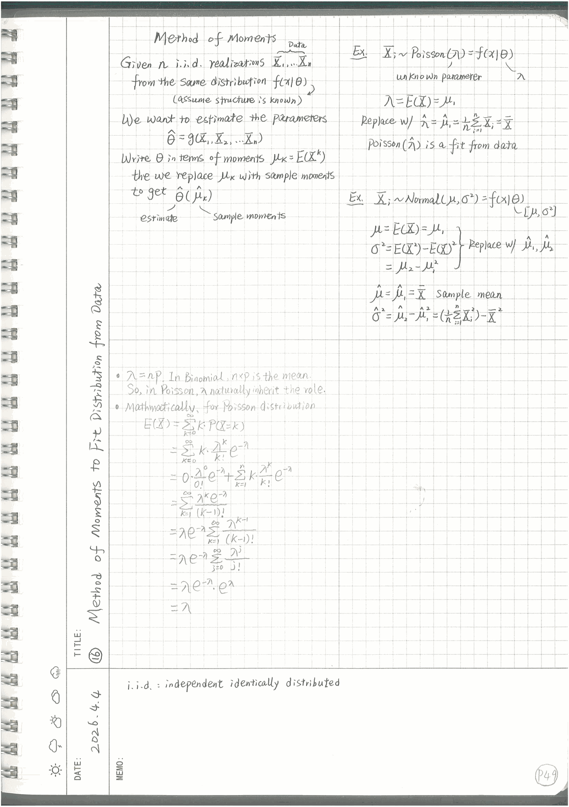

[⬆ Back to index](#episode-index)

---

### Episodes 17 & 18: Error in the Method of Moments / Bootstrapping and Monte Carlo Sampling in Statistics

**Episode 17: Error in the Method of Moments**

▶️ [Watch on YouTube](https://www.youtube.com/watch?v=341Ecdkfb-s&list=PLMrJAkhIeNNT14qn1c5qdL29A1UaHamjx&index=17)

> It is possible to estimate the distribution, and therefore the error, of our parameter estimates obtained from the method of moments. We will look at analytic estimates and bootstrap estimates from Monte Carlo Sampling.

**Episode 18: Bootstrapping and Monte Carlo Sampling in Statistics**

▶️ [Watch on YouTube](https://www.youtube.com/watch?v=wsU7YLcPXmE&list=PLMrJAkhIeNNT14qn1c5qdL29A1UaHamjx&index=18) · 🐍 [Python notebook](SDA18_Bootstrapping%20and%20Monte%20Carlo%20Sampling%20in%20Statistics.ipynb)

> Here we estimate the error of our parameter estimate from the method of moments using Monte Carlo sampling and the bootstrap. We investigate a Poisson estimation problem.

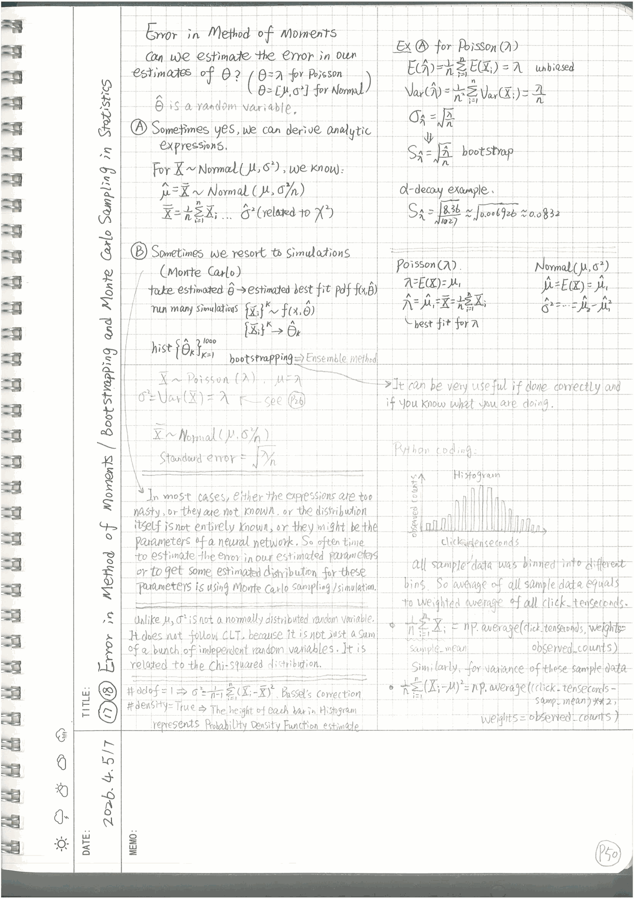

[⬆ Back to index](#episode-index)

---

### Episodes 19 & 20: Maximum Likelihood Estimation (MLE) with Examples / Maximum Likelihood Estimation Example: Fitting a Normal Distribution with Data

**Episode 19: Maximum Likelihood Estimation (MLE) with Examples**

▶️ [Watch on YouTube](https://www.youtube.com/watch?v=rCdxlN6Ph14&list=PLMrJAkhIeNNT14qn1c5qdL29A1UaHamjx&index=19)

> This video introduces Maximum Likelihood Estimation (MLE), one of the most important methods in statistical parameter estimation. MLE is the basis of the Bayesian extension, maximum a posteriori (MAP) estimation.

**Episode 20: Maximum Likelihood Estimation Example: Fitting a Normal Distribution with Data**

▶️ [Watch on YouTube](https://www.youtube.com/watch?v=x5GOUgCTkjM&list=PLMrJAkhIeNNT14qn1c5qdL29A1UaHamjx&index=20)

> Here we demonstrate how maximum likelihood estimation works by fitting a normal distribution with data.

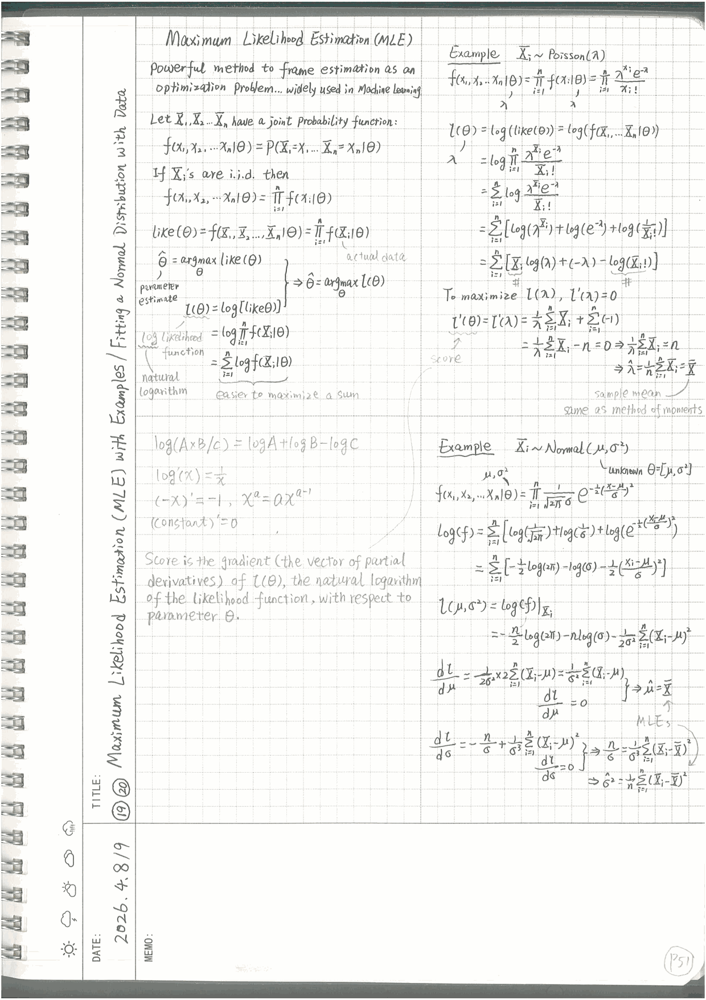

[⬆ Back to index](#episode-index)

---

### Episode 21: Properties of Maximum Likelihood Estimation

▶️ [Watch on YouTube](https://www.youtube.com/watch?v=QVF0oOh7s8c&list=PLMrJAkhIeNNT14qn1c5qdL29A1UaHamjx&index=21)

> Here we explore key properties of the MLE, such as consistency and data efficiency.

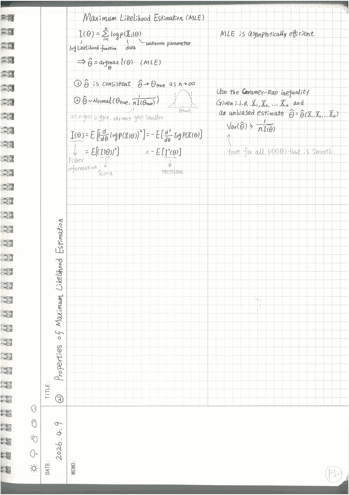

[⬆ Back to index](#episode-index)

---

### Episode 22: Bayesian Maximum Aposteriori Estimation (MAP): Extending Maximum Likelihood Estimation

▶️ [Watch on YouTube](https://www.youtube.com/watch?v=xgfexqYxrDU&list=PLMrJAkhIeNNT14qn1c5qdL29A1UaHamjx&index=22)

> Maximum Aposteriori Estimation (MAP) is a Bayesian extension to the maximum likelihood estimate (MLE) to include prior information into the estimate. This is a major technique in distribution estimation, especially in applications where data is sparse and/or expensive, such as seismic inversion.

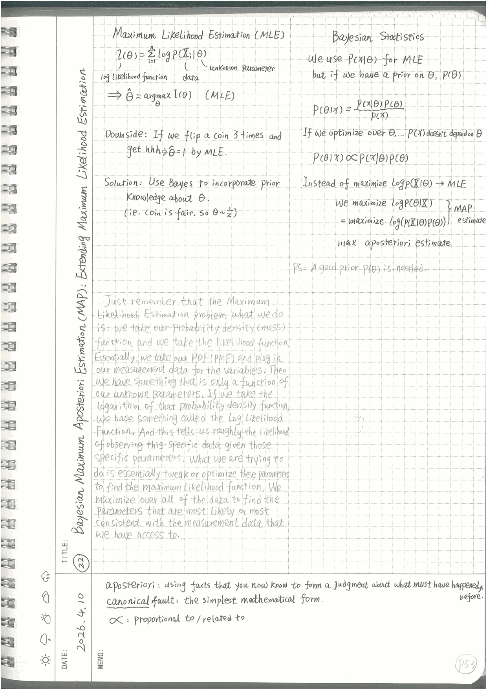

[⬆ Back to index](#episode-index)

---

### Episode 23: Consistency of Parameter Estimates in Statistics

▶️ [Watch on YouTube](https://www.youtube.com/watch?v=27wRPAg3H28&list=PLMrJAkhIeNNT14qn1c5qdL29A1UaHamjx&index=23)

> Here we dig deeper into what it means for a parameter estimate to be "consistent" in statistics. Essentially, this means that the estimate converges to the true value in some sense with increasing data.

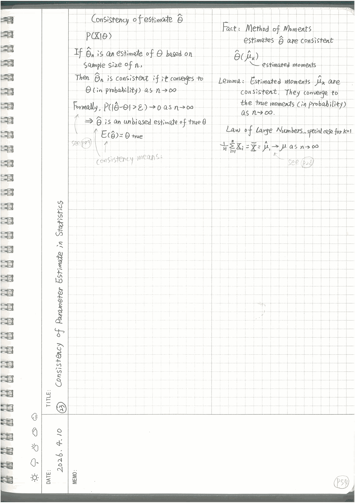

[⬆ Back to index](#episode-index)

---

### Episode 24: The Chi-Squared Test: Are Two Distributions the Same? (with Python Example)

▶️ [Watch on YouTube](https://www.youtube.com/watch?v=63S3FLISKMs&list=PLMrJAkhIeNNT14qn1c5qdL29A1UaHamjx&index=24) · 🐍 [Python notebook](SDA24_The%20Chi-squared%20Test.ipynb)

> This video asks a fundamental question in statistics: are two data sets from the same distribution or different distributions? We answer this using the Chi-squared test, with a python example.

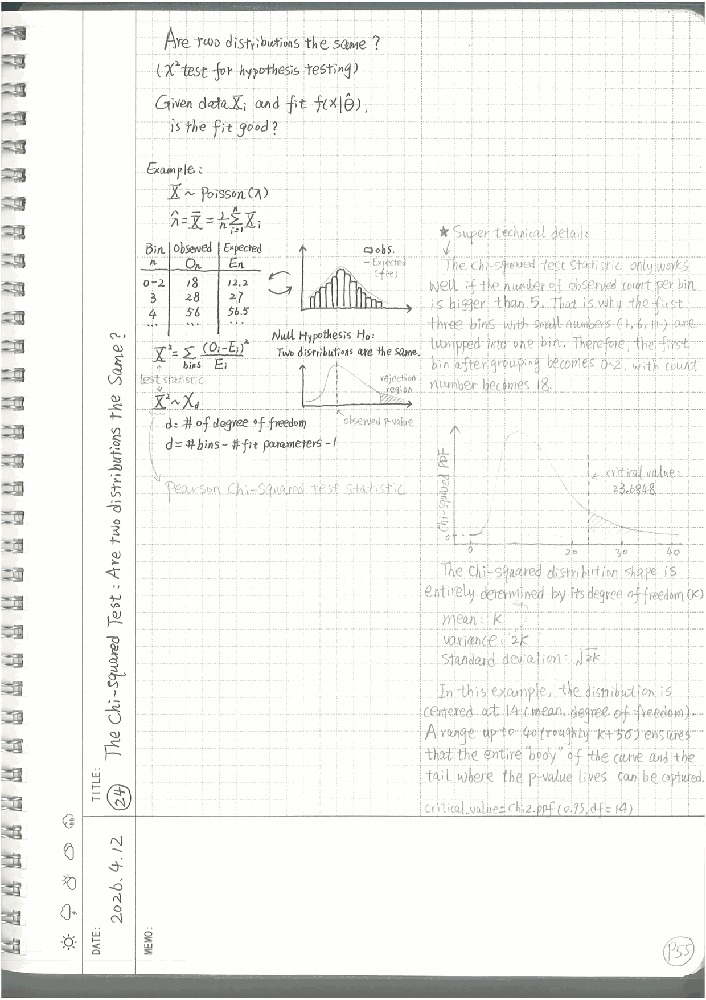

[⬆ Back to index](#episode-index)

---

### Episode 25: Student's t-distribution in Statistics

▶️ [Watch on YouTube](https://www.youtube.com/watch?v=kQoPUR0hQNo&list=PLMrJAkhIeNNT14qn1c5qdL29A1UaHamjx&index=25) · 🐍 [Python notebook](SDA25_Students%20t-distribution%20in%20Statistics.ipynb)

> The Student's t-distribution is an important distribution in statistics for hypothesis testing with small sample size n.

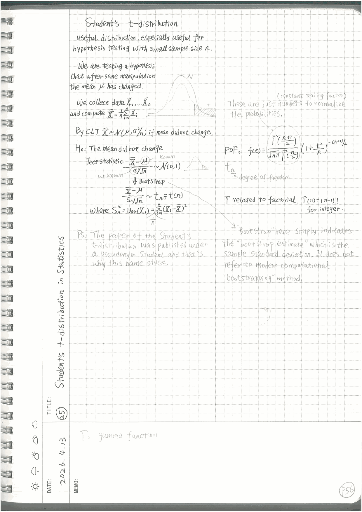

[⬆ Back to index](#episode-index)

---

### Episodes 26 & 27: Hypothesis Testing Revisited: Normal, t, and Chi-Squared Distribution Tests / Properties of Chi-Squared and Student's t Distributions

**Episode 26: Hypothesis Testing Revisited: Normal, t, and Chi-Squared Distribution Tests**

▶️ [Watch on YouTube](https://www.youtube.com/watch?v=u793OrRvZBk&list=PLMrJAkhIeNNT14qn1c5qdL29A1UaHamjx&index=26)

> Here we summarize various aspects of hypothesis testing, now that we know more about the key distributions.

**Episode 27: Properties of Chi-Squared and Student's t Distributions**

▶️ [Watch on YouTube](https://www.youtube.com/watch?v=so04ygeccwk&list=PLMrJAkhIeNNT14qn1c5qdL29A1UaHamjx&index=27)

> Here we derive some useful properties of the Student's t and Chi-Squared distributions.

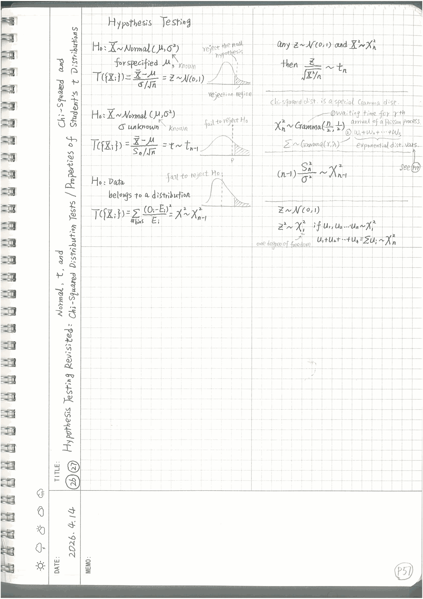

[⬆ Back to index](#episode-index)

---

### Episode 28: Bayesian Inference: Overview

▶️ [Watch on YouTube](https://www.youtube.com/watch?v=XCEpIBqKogo&list=PLMrJAkhIeNNT14qn1c5qdL29A1UaHamjx&index=28) · 🐍 [Python notebook](SDA28_Bayesian%20Inference-%20Overview.ipynb)

> This video introduces Bayesian inference and statistics, which is a powerful framework for learning distributions from data.

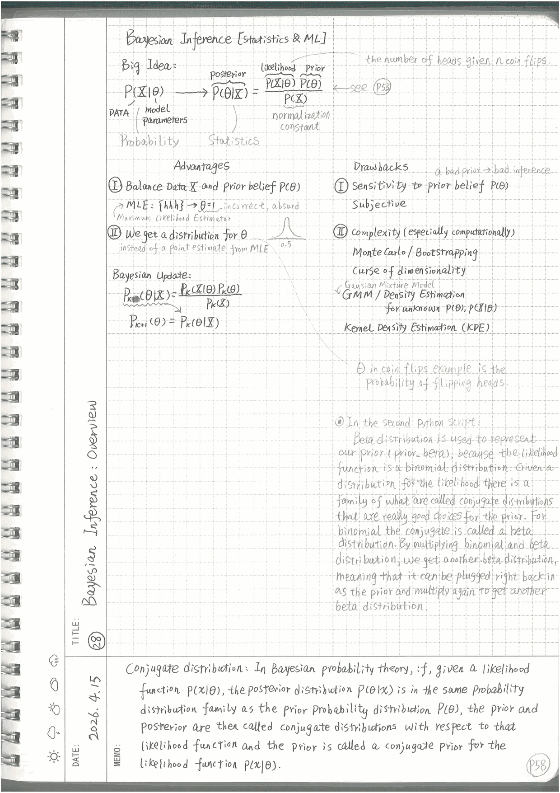

[⬆ Back to index](#episode-index)

---

### Episode 29: Bayesian Updates and Conjugate Priors

▶️ [Watch on YouTube](https://www.youtube.com/watch?v=GqSX-8AQL90&list=PLMrJAkhIeNNT14qn1c5qdL29A1UaHamjx&index=29)

> This video describes how to update Bayesian models with new information, and the importance of conjugate priors. As the posterior becomes the prior for the next update, it is helpful if the likelihood times the prior stay in the same distribution. This is the basic idea of conjugate priors, so that the likelihood and prior become "conjugate".

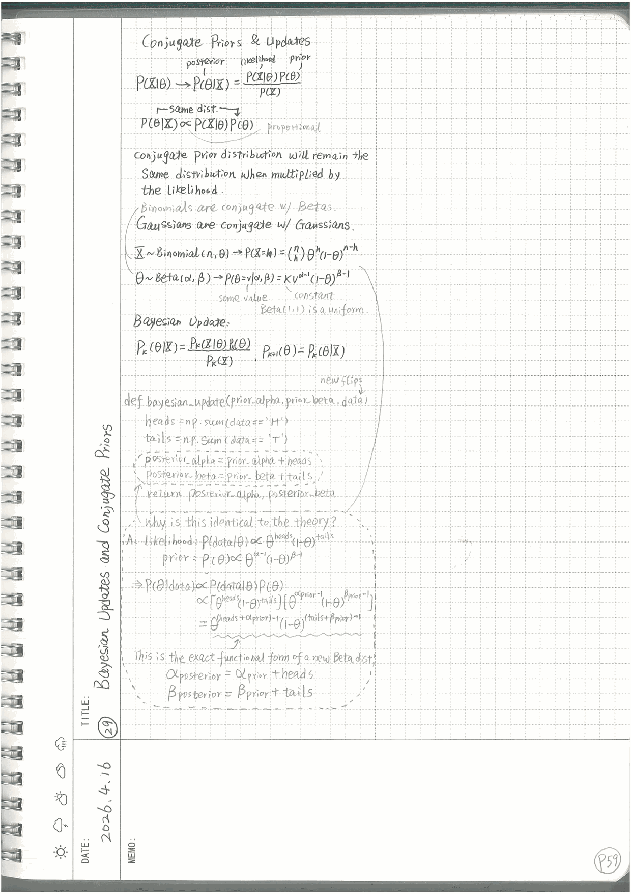

[⬆ Back to index](#episode-index)

---

### Episode 30: Conjugate Priors Example: Normal Distribution and the Exponential Family of Distributions

▶️ [Watch on YouTube](https://www.youtube.com/watch?v=q8ypTSQotXQ&list=PLMrJAkhIeNNT14qn1c5qdL29A1UaHamjx&index=30)

> Here we demonstrate conjugate priors with an example. Specifically Normal distributions are conjugate to themselves, so if the likelihood is Normal, we also choose Normal priors. More generally, the Exponential Family of Distributions are useful because they give an entire family of likelihoods and their conjugate priors.

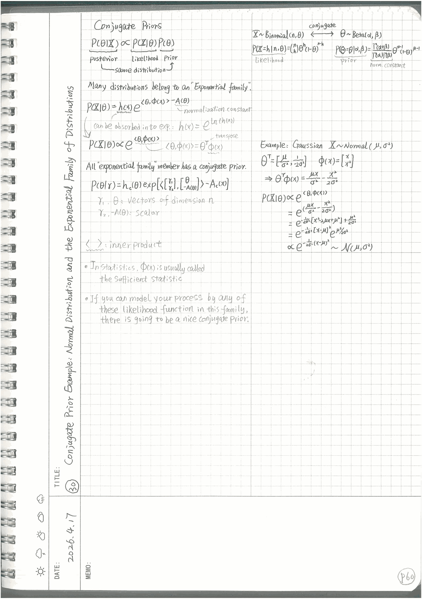

[⬆ Back to index](#episode-index)

---

### Episode 31: Density Estimation with Gaussian Mixture Models (GMM) and Empirical Priors

▶️ [Watch on YouTube](https://www.youtube.com/watch?v=a1pvm1QGXYg&list=PLMrJAkhIeNNT14qn1c5qdL29A1UaHamjx&index=31) · 🐍 [Python notebook](SDA31_Density%20Estimation%20with%20GMMs%20and%20Empirical%20Priors.ipynb)

> This video describes how to estimate more complex distributions using empirical distributions given by Gaussian mixture models (GMM). This is a baby step towards machine learning.

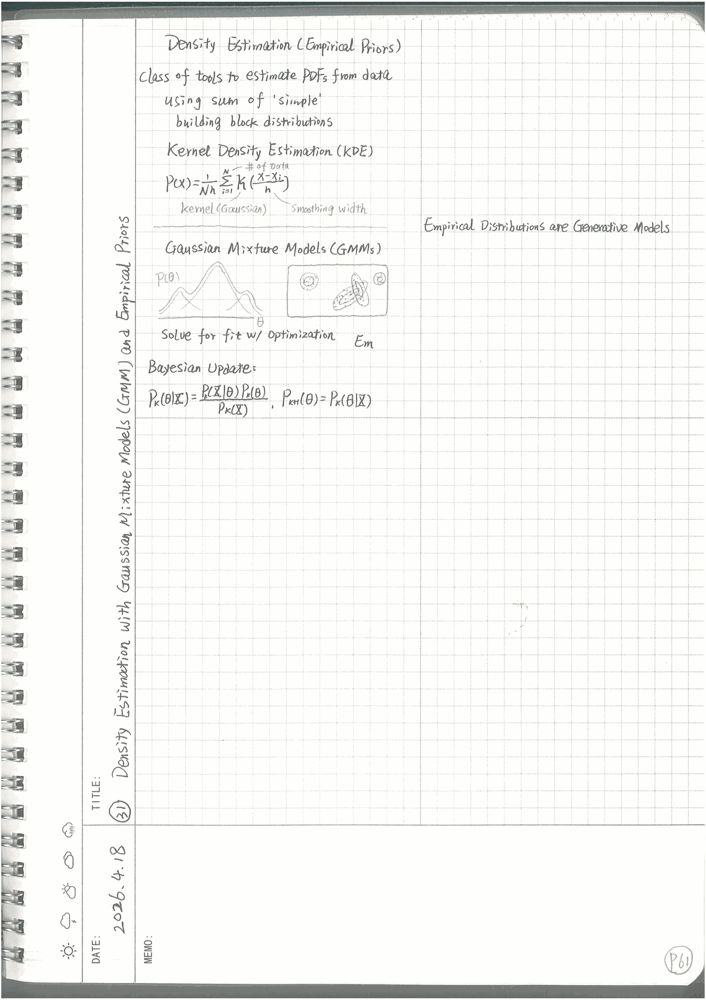

[⬆ Back to index](#episode-index)

---

### Episode 32: Monte Carlo Sampling and Bootstrapping in Bayesian Inference

▶️ [Watch on YouTube](https://www.youtube.com/watch?v=f1Vcc-bPfnU&list=PLMrJAkhIeNNT14qn1c5qdL29A1UaHamjx&index=32) · 🐍 [Python notebook](SDA32_Monte%20Carlo%20Sampling%20and%20Bootstrapping%20in%20Bayesian%20Inference.ipynb)

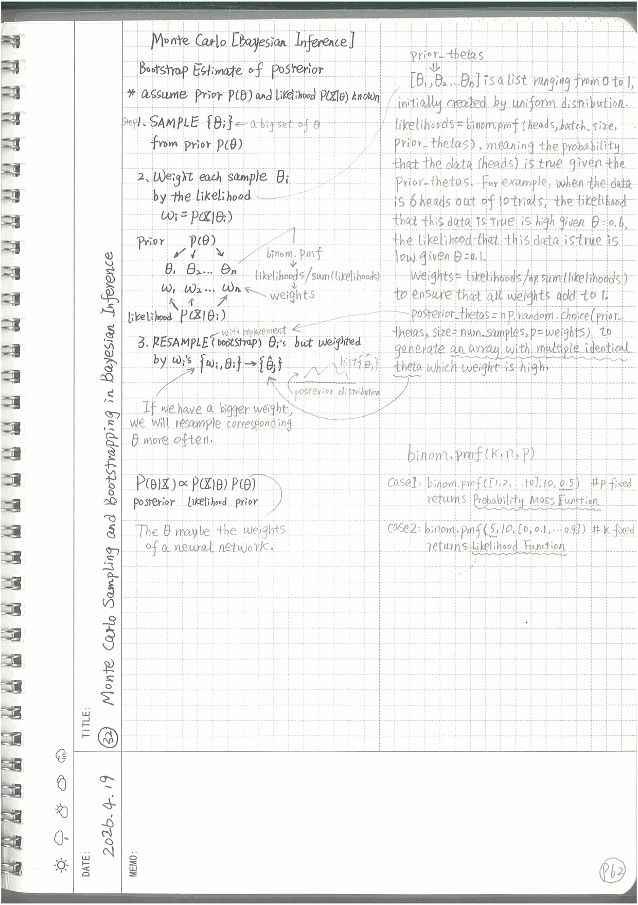

[⬆ Back to index](#episode-index)

---

### Episode 33: Bayesian Linear Regression and Maximum Likelihood Estimates

▶️ [Watch on YouTube](https://www.youtube.com/watch?v=qTRgdhgmFyc&list=PLMrJAkhIeNNT14qn1c5qdL29A1UaHamjx&index=33)

> In this video we show that the least squares regression fit is the maximum likelihood estimate assuming Gaussian noise on the measurements. This is a powerful fact that will allow us to incorporate prior information in the Bayesian framework.

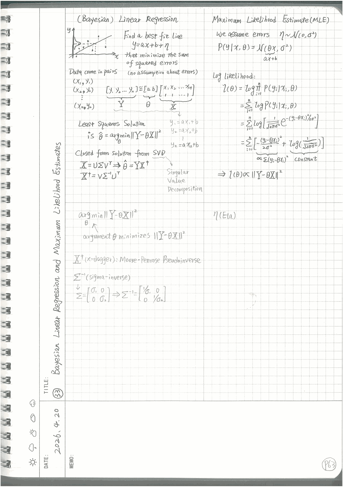

[⬆ Back to index](#episode-index)

---

### Episode 34: Bayesian Linear Regression and Maximum a Posteriori (MAP) Estimate

▶️ [Watch on YouTube](https://www.youtube.com/watch?v=wdWHbYdhfG8&list=PLMrJAkhIeNNT14qn1c5qdL29A1UaHamjx&index=34)

> In this video we show how to incorporate prior information into the least squares regression, consistent with the framework of Bayesian statistics. The so-called maximum a posteriori (MAP) estimate is one of the foundational tools in statistical fitting and machine learning.

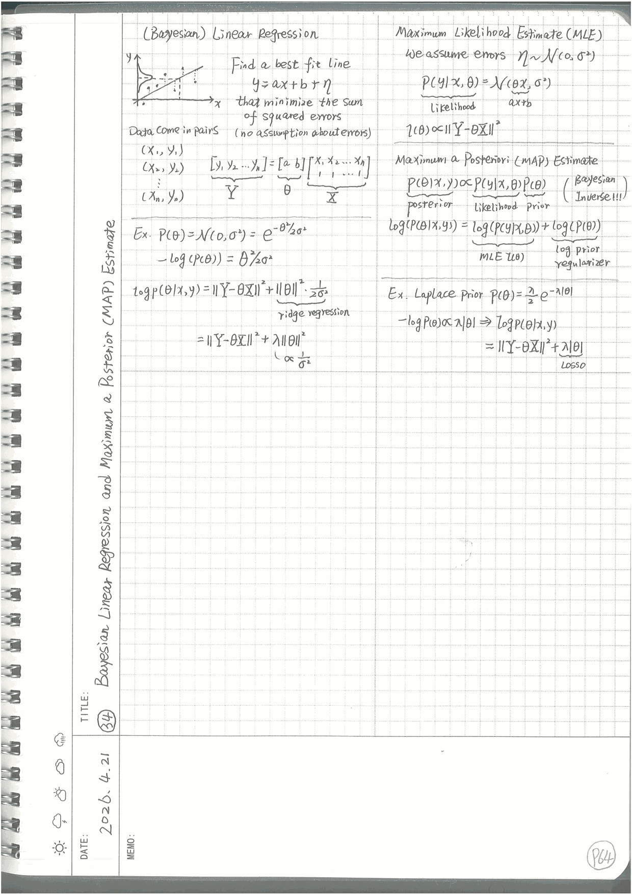

[⬆ Back to index](#episode-index)

---

## Acknowledgments

All course content, episode titles and descriptions belong to Dr. Steve Brunton. These notes are shared for educational purposes only. Please watch the original videos and support his channel.
